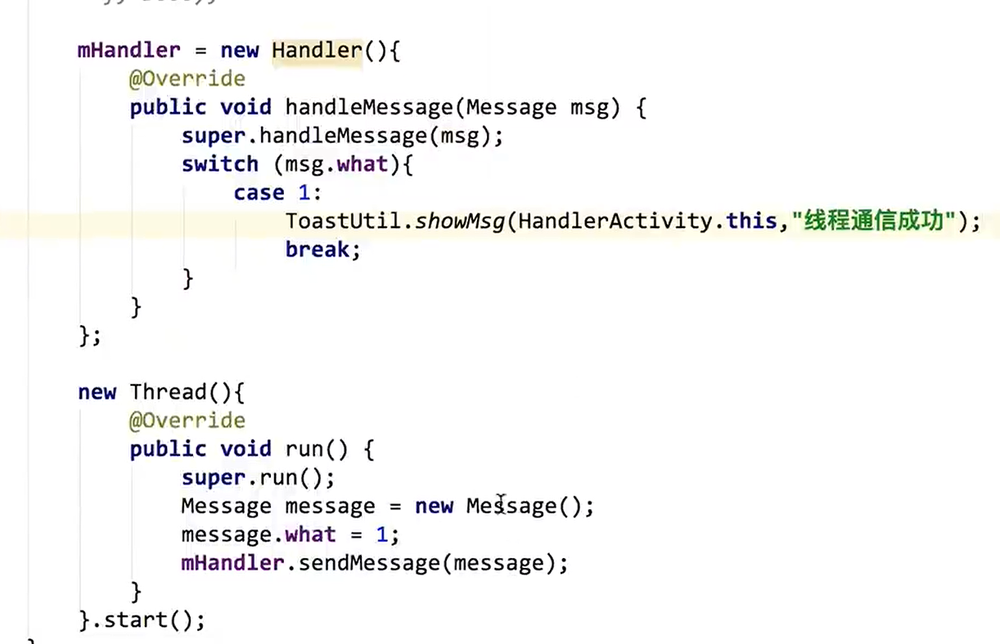

# [【天哥】Android 开发视频教程最新版 Android Studio 开发](https://www.bilibili.com/video/BV1Rt411e76H?t=4)

## 参考资料：

[【天哥】Android 开发视频教程最新版 Android Studio 开发](https://www.bilibili.com/video/BV1Rt411e76H)

[课程代码（天哥原版）](https://github.com/skypan-yes/AndroidCourse)

[课程代码（自己注释版本）](https://github.com/DayoWong0/AndroidCourse/tree/8a05eaf259c8c9b3df9351482dec3b44f276644b/app/src/main)

[天哥写的部分 ( master ) 和网友写的 ( beta ) 部分代码](https://github.com/taifus/Android_Learning)

[安卓基础入门-菜鸟教程（大致看了一下内容，写得很好）](https://www.runoob.com/w3cnote/android-tutorial-intro.html)

[Android 布局中的尺寸单位介绍](https://www.jianshu.com/p/0296fada6df3)

[Android layout 属性大全](https://blog.csdn.net/lushengchu_luis/article/details/8708099)

[Android 之 Adapter 用法总结](https://www.cnblogs.com/devinzhang/archive/2012/01/20/2328334.html)

## 遇到的问题

### 布局

布局对我来说好难 css 也是，定位达不到想要的效果。听完课自己上手操作就懵逼。

- 不明白 dp sp 等单位的意思

  每个视频教程都没提到

- 课程里讲解的布局例子不够需求

  - 需要自己多试试，去查每个控件有什么属性。

- padding 和 margin 意思知道，但是什么时候用哪一个不清楚

  padding margin 只在 LinearLayout 之类的元素里使用？

- orientation 和 gravity 区别

## 2.1 布局管理器

线性布局和相对布局用的多，其他不常用。

### 2.1.1 线性布局 LinearLayout

#### 常用属性

id

layout_width

layout_height

background

layout_margin

layout_padding

orientation （LinearLayout 特有）：子元素排列方式，水平 （ horizontal）和 垂直 （vertical）

#### 前端类似部分

- 布局宽高度通常使用 dp 而不是 px，这样便于布局适配屏幕

- padding margin background width height id 和 css 的一样

- 这个什么意思？

  orientation：方向。子元素排列对齐方向。

  ```xml
  android:orientation="horizontal"
  ```

- 匹配父空间（ match_parent ）

  布局文件从上到下开始，把前面的分配好了，从剩下的 宽/高 度分给匹配父空间的元素。

  ```xml
  <?xml version="1.0" encoding="utf-8"?>
  <LinearLayout xmlns:android="http://schemas.android.com/apk/res/android"
      android:layout_width="match_parent"
      android:layout_height="match_parent">

      <LinearLayout
          android:id="@+id/ll_1"
          android:layout_width="200dp"
          android:layout_height="200dp"
          android:orientation="horizontal"
          android:background="#000000"
          android:padding="20dp">
                <View
            android:layout_width="match_parent"
            android:layout_height="match_parent"
            android:background="#FF0033"/>
    	</LinearLayout>

    	<LinearLayout
        android:layout_width="match_parent"
        android:layout_height="200dp"
        android:orientation="horizontal"
        android:background="#0066FF">
    	</LinearLayout>
  </LinearLayout>
  ```

  第一个 LinearLayout 用了 父空间的 200dp 宽度，

  父空间剩下的宽度 = 父空间宽度 - 200dp，给第二个 LinearLayout

- LinearLayout 默认水平排列，改成垂直排列需要修改父布局的属性

  ```xml
  android:orientation="vertical">
  ```

* 设置两个子布局的边距

  用 margin

#### View 默认从左上排列

设置父元素的对齐方式属性改变这以默认行为

gravity：内部排列的元素的对齐方式。

gravity 和 oritation 区别？

```xml
android:gravity="center"
```

再加一个 View 元素，并让他们各占一半，引出下一个属性

#### 权重 weight ：按比例分配

```xml
android:layout_weight="1"
```

开始 width 属性都是设置的是 0dp

```xml
        <View
            android:layout_width="0dp"
            android:layout_height="match_parent"
            android:background="#000000"
            android:layout_weight="1"
            />

        <View
            android:layout_width="0dp"
            android:layout_height="match_parent"
            android:background="#ff0033"
            android:layout_weight="1"/>
```

现在：前一个设置的是 50dp，第一个会比第二个宽 50 dp

这是由于：weight 属性是从父空间先取出 第一个 View 中需要的 50 dp 后再按照 weight 比例来分的。若此时将第二个 width 也设置为 50 dp 他们又会同样宽了。

简单来说：weight 属性是将剩余内容按权重分配。width 属性设置为 0px 就行。 width 属性优先级大于 weight。

```xml
        <View
            android:layout_width="50dp"
            android:layout_height="match_parent"
            android:background="#000000"
            android:layout_weight="1"
            />

        <View
            android:layout_width="0dp"
            android:layout_height="match_parent"
            android:background="#ff0033"
            android:layout_weight="1"/>
```

布局可以嵌套，多练习，不练习没用。

果然工作过的人出来讲课比没开发经验的老师讲课好多了，并且比我自己看书效率高多了，

学习 Android 开发，我最害怕的就是界面设计。他把常用的讲了并且易懂。

### 2.1.2 相对布局 Relativelayout

- 相对布局中的相对是参照的意思。

- **使用相对布局之前，保证父布局是相对布局才行。**

  比如：父级为 LinearLayout 子布局为 RelativeLayout 此时子布局不能设置 **layout_alignParentBottom**

  可以在 他们之间加一层 RelativeLayout 布局：设置 width height 为 match_parent

  如下

  ```xml
  <?xml version="1.0" encoding="utf-8"?>
  <LinearLayout xmlns:android="http://schemas.android.com/apk/res/android"
      android:layout_width="match_parent"
      android:layout_height="match_parent"
      android:orientation="vertical">

      <RelativeLayout
          android:layout_width="match_parent"
          android:layout_height="match_parent">

          <RelativeLayout
              android:layout_width="match_parent"
              android:layout_height="40dp"
              android:background="#117CAC"
              android:layout_alignParentBottom="true"
              >

              <View
                  android:id="@+id/v_1"
                  android:layout_width="50dp"
                  android:layout_height="match_parent"
                  android:layout_marginLeft="60dp"
                  android:layout_marginTop="8dp"
                  android:layout_marginBottom="5dp"
                  android:background="#000000" />

              <View
                  android:id="@+id/v_2"
                  android:layout_width="50dp"
                  android:layout_height="match_parent"
                  android:layout_marginLeft="60dp"
                  android:layout_marginTop="8dp"
                  android:layout_marginBottom="5dp"
                  android:layout_toRightOf="@id/v_1"
                  android:background="#000000" />

              <View
                  android:id="@+id/v_3"
                  android:layout_width="50dp"
                  android:layout_height="match_parent"
                  android:layout_marginLeft="60dp"
                  android:layout_marginTop="8dp"
                  android:layout_marginBottom="5dp"
                  android:layout_toRightOf="@id/v_2"
                  android:background="#000000" />
          </RelativeLayout>
      </RelativeLayout>
  ```


  </LinearLayout>

  ```

align：排整齐;校准;(尤指)使成一条直线;使一致。 我遇见的意思多指：对齐方式。

#### 常用属性


看字面意思就能明白用法。

1. 在谁的左边、右边，底部对齐，对齐父空间底部、 在某个元素下面绘制下划线。

注意：安卓的布局文件命名只能小写字母加数字，否则不识别。

#### 作业

百度搜或者看你手机上的软件，可以只用 View 视图把他们的界面模仿出来，大致布局即可。

## 2.2 TextView

### 2.2.1 文字大小、颜色

text

textColor

### 2.2.2 textSize：常用单位为 sp

### 2.2.3 显示不下用 ... 省略

​```xml
android:ellipsize="end"
  ```

### 2.2.4 字体最多显示行数

```xml
android:maxLines="1"
```

### 2.2.5 文字 + icon

```xml
android:drawableRight="@drawable/ic_launcher_background"
```

### 2.2.6 中划线、下划线

可以由 getPaint().setFlags 方法

```java
mTv5.getPaint().setFlags(Paint.UNDERLINE_TEXT_FLAG);
```

html 标签的方法设置下划线和中划线。

```java
mTv6.setText(Html.fromHtml("<u>天哥在奔跑 html</u>"));
```

```xml
<?xml version="1.0" encoding="utf-8"?>
<LinearLayout xmlns:android="http://schemas.android.com/apk/res/android"
    android:layout_width="match_parent"
    android:layout_height="match_parent"
    android:orientation="vertical"
    android:padding="20dp">

    <TextView
        android:id="@+id/tv_1"
        android:layout_width="wrap_content"
        android:layout_height="wrap_content"
        android:text="@string/tv_test1"
        android:textColor="#000000"
        android:textSize="24sp"
        />

    <TextView
        android:id="@+id/tv_2"
        android:layout_width="100dp"
        android:layout_height="wrap_content"
        android:text="@string/tv_test1"
        android:maxLines="1"
        android:ellipsize="end"
        android:textColor="#000000"
        android:textSize="24sp"
        android:layout_marginTop="10dp"
        />

    <TextView
        android:id="@+id/tv_3"
        android:layout_width="wrap_content"
        android:layout_height="wrap_content"
        android:text="筛选"
        android:drawableRight="@drawable/ic_launcher_background"
        android:drawablePadding="10dp"
        android:textColor="#000000"
        android:textSize="24sp"
        android:layout_marginTop="10dp"/>

    <TextView
        android:id="@+id/tv_4"
        android:layout_width="wrap_content"
        android:layout_height="wrap_content"
        android:text="@string/tv_test1"
        android:maxLines="1"
        android:ellipsize="end"
        android:textColor="#000000"
        android:textSize="24sp"
        android:layout_marginTop="10dp"
        />

    <TextView
        android:id="@+id/tv_5"
        android:layout_width="wrap_content"
        android:layout_height="wrap_content"
        android:text="@string/tv_test1"
        android:textColor="#000000"
        android:textSize="24sp"
        android:layout_marginTop="10dp"
        />

    <TextView
        android:id="@+id/tv_6"
        android:layout_width="wrap_content"
        android:layout_height="wrap_content"
        android:textColor="#000000"
        android:textSize="24sp"
        />


</LinearLayout>
```

```java
package com.example.a1linearlayout;

import androidx.appcompat.app.AppCompatActivity;

import android.graphics.Paint;
import android.os.Bundle;
import android.text.Html;
import android.widget.TextView;

public class TextViewActivity extends AppCompatActivity {

    private TextView mTv4;
    private TextView mTv5;
    private TextView mTv6;
    @Override
    protected void onCreate(Bundle savedInstanceState) {
        super.onCreate(savedInstanceState);
        setContentView(R.layout.activity_text_view);
        mTv4 = findViewById(R.id.tv_4);

        mTv4.getPaint().setFlags(Paint.STRIKE_THRU_TEXT_FLAG);
        // 去除锯齿
        mTv4.getPaint().setAntiAlias(true);

        mTv5 = findViewById(R.id.tv_5);
        mTv5.getPaint().setFlags(Paint.UNDERLINE_TEXT_FLAG);

        mTv6 = findViewById(R.id.tv_6);
        mTv6.setText(Html.fromHtml("<u>天哥在奔跑 html</u>"));
    }
}
```

### 2.2.7 跑马灯

```xml
    <TextView
        android:id="@+id/tv_7"
        android:layout_width="wrap_content"
        android:layout_height="wrap_content"
        android:text="天哥在奔跑天哥在奔跑天哥在奔跑天哥在奔跑天哥在奔跑"
        android:textColor="#000000"
        android:singleLine="true"
        android:ellipsize="marquee"
        android:marqueeRepeatLimit="marquee_forever"
        android:focusable="true"
        android:clickable="true"
        android:focusableInTouchMode="true"
        android:textSize="24sp"
        />
```

 点击之后才能实现

## 2.3 Button

### 2.3.1 文字大小、颜色

```xml
android:textSize="20sp"
android:textColor="#ffffff"
```

### 2.3.2 自定义背景形状

用

android:background="@drawable/bg_btn2"

android:background="@drawable/bg_btn3"

引用自定义背景

```xml
<?xml version="1.0" encoding="utf-8"?>
<RelativeLayout xmlns:android="http://schemas.android.com/apk/res/android"
    android:layout_width="match_parent"
    android:layout_height="match_parent"
    android:padding="15dp">
    <Button
        android:id="@+id/btn_1"
        android:layout_width="match_parent"
        android:layout_height="40dp"
        android:text="按钮1"
        android:textSize="20sp"
        android:textColor="#ffffff"
        android:background="#ff0000"/>

    <Button
        android:id="@+id/btn_2"
        android:layout_width="match_parent"
        android:layout_height="40dp"
        android:text="按钮2"
        android:textSize="20sp"
        android:textColor="#ffffff"
        android:background="@drawable/bg_btn2"
        android:layout_below="@id/btn_1"
        android:layout_marginTop="10dp"/>

    <Button
        android:id="@+id/btn_3"
        android:layout_width="match_parent"
        android:layout_height="40dp"
        android:text="按钮1"
        android:textSize="20sp"
        android:textColor="#ff9900"
        android:background="@drawable/bg_btn3"
        android:layout_below="@id/btn_2"
        android:layout_marginTop="10dp"/>
</RelativeLayout>
```

自定义背景为

drawable/Bg_btn2.xml

```xml
<?xml version="1.0" encoding="utf-8"?>
<shape xmlns:android="http://schemas.android.com/apk/res/android"
    android:shape="rectangle">

    <solid
        android:color="#ff9900"/>
    <corners
        android:radius="15dp"/>
</shape>
```

drawable/Bg_btn_3.xml

```xml
<?xml version="1.0" encoding="utf-8"?>
<shape xmlns:android="http://schemas.android.com/apk/res/android"
    android:shape="rectangle">
<!--    描边-->
    <stroke
        android:width="1dp"
        android:color="#ff9900"/>
    <corners
        android:radius="15dp"/>
</shape>
```

### 2.3.3 自定义按压效果

```xml
    <Button
        android:id="@+id/btn_4"
        android:layout_width="match_parent"
        android:layout_height="40dp"
        android:text="按钮4"
        android:textSize="20sp"
        android:textColor="#ffffff"
        android:background="@drawable/bg_btn4"
        android:layout_marginTop="10dp"
        android:layout_below="@id/btn_3"/>
```

drawable/bg_btn4

```xml
<?xml version="1.0" encoding="utf-8"?>
<selector xmlns:android="http://schemas.android.com/apk/res/android">

<!--    按压时候的效果-->
    <item android:state_pressed="true">
        <shape>
            <solid android:color="#cc7a00"/>
            <corners android:radius="5dp"/>
        </shape>
    </item>
<!--    没有按压时的效果-->
    <item android:state_pressed="false">
        <shape>
            <solid android:color="#ff9900"/>
            <corners android:radius="5dp"/>
        </shape>
    </item>
</selector>
```

### 2.3.4 绑定点击事件

#### 方式 1（不常用）

```xml
    <Button
        android:id="@+id/btn_5"
        android:layout_width="match_parent"
        android:layout_height="40dp"
        android:text="按钮5"
        android:textSize="20sp"
        android:textColor="#ffffff"
        android:background="@drawable/bg_btn4"
        android:layout_marginTop="10dp"
        android:onClick="showToast"
        android:layout_below="@id/btn_4"/>
```

Java 方法

```java
    public void showToast(View view) {
        Toast.makeText(this,"我被点击了", Toast.LENGTH_SHORT).show();
    }
```

#### 方式 2 （常用方式）

```java
public class ButtonActivity extends AppCompatActivity {


    private Button mBtn3;
    @Override
    protected void onCreate(Bundle savedInstanceState) {
        super.onCreate(savedInstanceState);
        setContentView(R.layout.activity_button);
        mBtn3 = findViewById(R.id.btn_3);
        mBtn3.setOnClickListener(new View.OnClickListener() {
            @Override
            public void onClick(View view) {
                Toast.makeText(ButtonActivity.this,"Button3被点击了", Toast.LENGTH_SHORT).show();
            }
        });
    }
}
```

```xml
    <Button
        android:id="@+id/btn_3"
        android:layout_width="match_parent"
        android:layout_height="40dp"
        android:text="按钮3"
        android:textSize="20sp"
        android:textColor="#ff9900"
        android:background="@drawable/bg_btn3"
        android:layout_below="@id/btn_2"
        android:layout_marginTop="10dp"/>
```

TextView 也可以被点击和 Button 绑定点击事件一样的。

## 2.4 EditText

### 2.4.1 常用属性

```xml
    <EditText
        android:id="@+id/et_2"
        android:layout_width="match_parent"
        android:layout_height="50dp"
        android:textSize="16sp"
        android:textColor="#ffad33"
        android:inputType="textPassword"
        android:hint="输入密码时候的提示"
        android:layout_below="@id/et_1"
        android:background="@drawable/bg_username"
        android:layout_marginTop="15dp"
        android:paddingLeft="20dp"
        android:paddingRight="20dp"
        />

    <Button
        android:id="@+id/btn_login"
        android:layout_width="match_parent"
        android:layout_height="40dp"
        android:layout_below="@id/et_2"
        android:layout_marginTop="40dp"
        android:layout_marginLeft="90px"
        android:layout_marginRight="90px"
        android:background="@drawable/bg_btn4"
        android:text="登录"
        android:textSize="20sp"
        android:textColor="#fff"/>
```

### 2.4.2 监听事件

```xml
    <EditText
        android:id="@+id/et_1"
        android:layout_width="match_parent"
        android:layout_height="50dp"
        android:textSize="16sp"
        android:textColor="#ffad33"
        android:hint="用户名（用户输入时的提示信息）"
        android:background="@drawable/bg_username"
        android:paddingLeft="20dp"
        android:paddingRight="20dp"
        android:drawableLeft="@mipmap/ic_launcher_round"
        android:drawablePadding="5dp"
        android:maxLines="1"
        />
```

setOnClickListener 监听点击事件

addTextChangedListener 监听输入状态，charSequence 为当前输入框中的文本内容

```java
public void onTextChanged(CharSequence charSequence, int i, int i1, int i2)
```

---

```java
package com.example.a1linearlayout;

import androidx.appcompat.app.AppCompatActivity;

import android.os.Bundle;
import android.text.Editable;
import android.text.TextWatcher;
import android.util.Log;
import android.view.View;
import android.widget.Button;
import android.widget.EditText;
import android.widget.Toast;

public class EditTextActivity extends AppCompatActivity {

    private Button mBtnLogin;
    private EditText mEtUserName;
    @Override
    protected void onCreate(Bundle savedInstanceState) {
        super.onCreate(savedInstanceState);
        setContentView(R.layout.activity_edit_text);
        mBtnLogin = findViewById(R.id.btn_login);

        mBtnLogin.setOnClickListener(new View.OnClickListener() {
            @Override
            public void onClick(View view) {
                Toast.makeText(EditTextActivity.this, "登录成功", Toast.LENGTH_SHORT).show();
            }
        });

        mEtUserName = findViewById(R.id.et_1);
        // 输入变化的监听
        mEtUserName.addTextChangedListener(new TextWatcher() {
            @Override
            public void beforeTextChanged(CharSequence charSequence, int i, int i1, int i2) {

            }

            @Override
            public void onTextChanged(CharSequence charSequence, int i, int i1, int i2) {
                // charSequence 为当前输入框中的内容
                Log.d("editText",charSequence.toString());
            }

            @Override
            public void afterTextChanged(Editable editable) {

            }
        });
    }
}
```

## 封装 Intent 方法

```java
package com.example.a1linearlayout;

import androidx.appcompat.app.AppCompatActivity;

import android.content.Intent;
import android.os.Bundle;
import android.view.View;
import android.widget.Button;

public class MainActivity extends AppCompatActivity {

    // 声明 Button 组件
    private Button mBtnTextView;
    private Button mBtnButton;
    private Button mBtnEditText;
    private Button mBtnRadioButton;

    @Override
    protected void onCreate(Bundle savedInstanceState) {
        super.onCreate(savedInstanceState);
//        setContentView(R.layout.linear_layout);
//        setContentView(R.layout.a01linear_layout);
//        setContentView(R.layout.a02relative_layout);
        setContentView(R.layout.a03text_view);

        mBtnTextView = findViewById(R.id.btn_textview);
        mBtnButton = findViewById(R.id.btn_button);
        mBtnEditText = findViewById(R.id.btn_edittext);
        mBtnRadioButton = findViewById(R.id.btn_radiobutton);
        setListeners();
    }

    private void setListeners(){
        OnClick onClick = new OnClick();
        mBtnTextView.setOnClickListener(onClick);
        mBtnButton.setOnClickListener(onClick);
        mBtnEditText.setOnClickListener(onClick);
        mBtnRadioButton.setOnClickListener(onClick);
    }

    private class OnClick implements View.OnClickListener{

        @Override
        public void onClick(View view) {
            Intent intent = null;
            switch (view.getId()){
                case R.id.btn_textview:
                    // 跳转到 TextView 演示界面
                    intent = new Intent(MainActivity.this, TextViewActivity.class);
                    startActivity(intent);
                    break;
                case R.id.btn_button:
                    // 跳转到 Button 演示界面
                    intent = new Intent(MainActivity.this, ButtonActivity.class);
                    startActivity(intent);
                    break;
                case R.id.btn_edittext:
                    // 跳转到 EditText 演示界面
                    intent = new Intent(MainActivity.this, EditTextActivity.class);
                    startActivity(intent);
                    break;
                case R.id.btn_radiobutton:
                    // 跳转到 RadioButtonActivity 演示界面
                    intent = new Intent(MainActivity.this, RadioButtonActivity.class);
                    startActivity(intent);
                    break;
            }
            startActivity(intent);
        }
    }
}

```

## 2.5 RadioButton 和 RadioGroup

### RadioButton

- checked 属性：true 默认选中，需要加 id 属性，否则会无作用。

### RadioGroup

- below 属性
- orientation 属性

## 去掉应用名称

Styles.xml：NoActionBar

```xml
<style name="AppTheme" parent="Theme.AppCompat.Light.NoActionBar">
```

## 2.6 CheckBox 复选框

## 2.7 ImageView 和 使用第三方库加载网络图片

ImageView

- scaleType

  - fitXY

    撑满控件，宽高可能改变

  - fitCenter

    保持宽高比缩放，直至能完全显示

  - centerCrop

    保持宽高比缩放，直至完全覆盖控件，裁剪显示

- 网络库 Glide https://github.com/bumptech/glide

  上 GitHub 搜索 Glide 将 Gradle 配置文件粘贴到 build.gradle 模块配置文件中（不是全局的 build.gradle 文件）

  

  后点击 Sync Gradle

  编写代码

  ```java
  private ImageView mIv4;
  ...
  Glide.with(this).load("https://ss0.bdstatic.com/5aV1bjqh_Q23odCf/static/superman/img/logo/bd_logo1_31bdc765.png").into(mIv4);
  ```

  再 manifest 加入网络权限

  ```xml
  <uses-permission android:name="android.permission.INTERNET" />
  ```

## 2.8 ListView 列表视图（了解即可）

ListView 被 RecycleView 代替

#### 常用属性

#### Adapter 接口

##### 概念

[Android 之 Adapter 用法总结](https://www.cnblogs.com/devinzhang/archive/2012/01/20/2328334.html)

Adapter 是连接后端数据和前端显示的适配器接口，是数据和 UI（View）之间一个重要的纽带


xml listSelector 属性：选择后的颜色等属性。

## 2.9 GridView 网格视图

### 属性

- ```
  <?xml version="1.0" encoding="utf-8"?>
  <LinearLayout xmlns:android="http://schemas.android.com/apk/res/android"
      android:layout_width="match_parent"
      android:layout_height="match_parent"
      android:orientation="vertical"
      android:padding="15dp">
      <GridView
          android:id="@+id/gv"
          android:layout_width="match_parent"
          android:layout_height="wrap_content"
          android:numColumns="3" // 三列
          android:horizontalSpacing="10dp" // 横向/左右 距离
          android:verticalSpacing="10dp"/> // 垂直/上下 距离
  </LinearLayout>
  ```

### Adapter 似懂非懂

## 2.10 滚动视图 ScrollView

- 子元素只能有一个

  之前的 LinearLayout 作为一个整体放在 ScrollView 内部

- 布局嵌套可以实现部分元素可以左右滚动

## 2.11 RecycleView

先跳过了

## 2.12 WebView

### 作用

- 加载 URL ( 网络或本地 assets 文件夹下的 html 文件 )

  - ```java
    webview.loadUrl("https://m.baidu.com");
    webview.loadUrl("file:///android_asset/test.html"); // 三个斜杠
    ```

- 加载 html 代码

  ```java
  webview.loadData(); // 可能出现乱码
  webview.loadDataWithBaseURL(); // 乱码情况少一些
  ```

  

  

* Native 和 JavaScript 相互调用

  ```java
              // 执行 JavaScript 代码
              mWvMain.evaluateJavascript("javascript:alert('hello')",callbackfunction());
  ```

## 3.1 Toast

- 显示位置

  ```java
  // 居中 Toast
  Toast toastCenter = Toast.makeText(getApplicationContext(),"居中Toast",Toast.LENGTH_LONG);
  toastCenter.setGravity(Gravity.CENTER,0,0);
  toastCenter.show();
  ```

* 自定义样式（ 加图片、文字 ）

  ```java
  Toast toastCustom = new Toast(getApplicationContext());
  LayoutInflater inflater = LayoutInflater.from(ToastActivity.this);
  View view = inflater.inflate(R.layout.layout_toast,null);
  ImageView imageView = (ImageView) view.findViewById(R.id.iv_toast);
  TextView textView = (TextView) view.findViewById(R.id.tv_toast);
  imageView.setImageResource(R.drawable.icon_smile);
  textView.setText("自定义Toast");
  toastCustom.setView(view);
  toastCustom.setDuration(Toast.LENGTH_LONG);
  toastCustom.show();
  ```

- 封装使得 （什么原因？）点击 Toast 马上显示，没有排队现象

  ```java
  package com.skypan.helloworld.util;

  import android.content.Context;
  import android.widget.Toast;

  /**
   * Created by skypan on 2017/9/5.
   */

  public class ToastUtil {
      public static Toast mToast;
      public static void showMsg(Context context,String msg){
          if(mToast == null){
              mToast = Toast.makeText(context,msg,Toast.LENGTH_LONG);
          }else{
              mToast.setText(msg);
          }
          mToast.show();
      }
  }
  ```

## 3.2 AlertDialog

AlertDialog 两个包内都有

1. android.support.v7.app

   兼容包，各个版本都适用，用这个即可

2. android.app

```java
AlertDialog.Builder builder = new AlertDialog.Builder(DialogActivity.this);
```

Builder 设计模式，感兴趣自行学习。

链式编程 和 JavaScript 好像。

- 默认样式

  ```java
  AlertDialog.Builder builder = new AlertDialog.Builder(DialogActivity.this);
  builder.setTitle("请回答").setMessage("你觉得课程如何？")
      .setIcon(R.drawable.icon_user)
      .setPositiveButton("棒", new DialogInterface.OnClickListener() {
          @Override
          public void onClick(DialogInterface dialog, int which) {
              ToastUtil.showMsg(DialogActivity.this, "你很诚实");
          }
      }).setNeutralButton("还行", new DialogInterface.OnClickListener() {
      @Override
      public void onClick(DialogInterface dialog, int which) {
          ToastUtil.showMsg(DialogActivity.this, "你再瞅瞅～");
      }
  }).setNegativeButton("不好", new DialogInterface.OnClickListener() {
      @Override
      public void onClick(DialogInterface dialog, int which) {
          ToastUtil.showMsg(DialogActivity.this, "睁眼说瞎话");
      }
  }).show();
  ```

  到目前为止提到的 Context（上下文)多指

  ```java
  类名.this
  ```

* 单选样式

  1. 没有 RadioButton，少用

     ```java
     final String[] array2 = new String[]{"男", "女"};
     AlertDialog.Builder builder2 = new AlertDialog.Builder(DialogActivity.this);
     builder2.setTitle("选择性别").setItems(array2, new DialogInterface.OnClickListener() {
         @Override
         public void onClick(DialogInterface dialog, int which) {
             ToastUtil.showMsg(DialogActivity.this, array2[which]);
         }
     }).show();
     ```

     2. 有 RadioButton

        ```java
        final String[] array3 = new String[]{"男", "女"};
        AlertDialog.Builder builder3 = new AlertDialog.Builder(DialogActivity.this);
        builder3.setTitle("选择性别").setSingleChoiceItems(array3, 1, new DialogInterface.OnClickListener() {
            @Override
            public void onClick(DialogInterface dialog, int which) {
                ToastUtil.showMsg(DialogActivity.this, array3[which]);
                dialog.dismiss();
            }
        }).setCancelable(false) // 必须选择对话框才消失
            .show();
        ```

- 多选样式

  ```java
  final String[] array4 = new String[]{"唱歌", "跳舞","写代码"};
  boolean[] isSelected = new boolean[]{false,false,true};
  AlertDialog.Builder builder4 = new AlertDialog.Builder(DialogActivity.this);
  builder4.setTitle("选择兴趣").setMultiChoiceItems(array4, isSelected, new DialogInterface.OnMultiChoiceClickListener() {
      @Override
      public void onClick(DialogInterface dialog, int which, boolean isChecked) {
          ToastUtil.showMsg(DialogActivity.this,array4[which]+":"+isChecked);
      }
  }).setPositiveButton("确定", new DialogInterface.OnClickListener() {
      @Override
      public void onClick(DialogInterface dialog, int which) {
          //
      }
  }).setNegativeButton("取消", new DialogInterface.OnClickListener() {
      @Override
      public void onClick(DialogInterface dialog, int which) {

      }
  }).show();
  ```

* 自定义

  ```java
  AlertDialog.Builder builder5 = new AlertDialog.Builder(DialogActivity.this);
  // 自定义布局
  View view = LayoutInflater.from(DialogActivity.this).inflate(R.layout.layout_dialog,null);
  EditText etUserName = (EditText) view.findViewById(R.id.et_username);
  EditText etPassWord = (EditText) view.findViewById(R.id.et_password);
  Button btnLogin = (Button) view.findViewById(R.id.btn_login);
  btnLogin.setOnClickListener(new View.OnClickListener() {
      @Override
      public void onClick(View v) {
          //
      }
  });
  builder5.setTitle("请先登录").setView(view).show();
  ```

## 3.3 ProgressBar & ProgressDialog

```java
package com.skypan.helloworld;

import android.app.Dialog;
import android.app.ProgressDialog;
import android.content.DialogInterface;
import android.os.Bundle;
import android.os.Handler;
import android.os.Message;
import android.support.v7.app.AppCompatActivity;
import android.view.View;
import android.widget.Button;
import android.widget.ProgressBar;

import com.skypan.helloworld.util.ToastUtil;

public class ProgressActivity extends AppCompatActivity {

    private ProgressBar mPb3;
    private Button mBtnStart,mBtnProgressDialog1,mBtnProgressDialog2;

    @Override
    protected void onCreate(Bundle savedInstanceState) {
        super.onCreate(savedInstanceState);
        setContentView(R.layout.activity_progress);
        mPb3 = (ProgressBar) findViewById(R.id.pb3);
        mBtnStart = (Button) findViewById(R.id.btn_start);
        mBtnProgressDialog1 = (Button) findViewById(R.id.btn_progress_dialog1);
        mBtnProgressDialog2 = (Button) findViewById(R.id.btn_progress_dialog2);
        mBtnStart.setOnClickListener(new View.OnClickListener() {
            @Override
            public void onClick(View v) {
                handler.sendEmptyMessage(0);
            }
        });
        mBtnProgressDialog1.setOnClickListener(new View.OnClickListener() {
            @Override
            public void onClick(View v) {
                ProgressDialog progressDialog = new ProgressDialog(ProgressActivity.this);
                progressDialog.setTitle("提示");
                progressDialog.setMessage("正在加载");
                progressDialog.setOnCancelListener(new DialogInterface.OnCancelListener() {
                    @Override
                    public void onCancel(DialogInterface dialog) {
                        ToastUtil.showMsg(ProgressActivity.this,"cancel...");
                    }
                });
                progressDialog.setCancelable(false);
                progressDialog.show();
            }
        });
        mBtnProgressDialog2.setOnClickListener(new View.OnClickListener() {
            @Override
            public void onClick(View v) {
                ProgressDialog progressDialog = new ProgressDialog(ProgressActivity.this);
                progressDialog.setProgressStyle(ProgressDialog.STYLE_HORIZONTAL);
                progressDialog.setTitle("提示");
                progressDialog.setMessage("正在下载...");
                progressDialog.setButton(DialogInterface.BUTTON_POSITIVE, "棒", new DialogInterface.OnClickListener() {
                    @Override
                    public void onClick(DialogInterface dialog, int which) {
                        //
                    }
                });
                progressDialog.show();
            }
        });
    }

    Handler handler = new Handler(){
        @Override
        public void handleMessage(Message msg) {
            super.handleMessage(msg);
            if(mPb3.getProgress() < 100){
                handler.postDelayed(runnable,500);
            }else{
                ToastUtil.showMsg(ProgressActivity.this,"加载完成");
            }
        }
    };

    Runnable runnable = new Runnable() {
        @Override
        public void run() {
            mPb3.setProgress(mPb3.getProgress()+5);
            handler.sendEmptyMessage(0);
        }
    };
}

```

## 3.4 自定义 Dialog

```java
IOnCancelListener
```

~~自定义类这部分没懂，这方面用的少，Java 语言的问题。~~，再看了一遍懂了

这一集 23 分钟左右 讲到了链式编程的实现，自己写一个类，set 方法返回值为 this（此 class ）。然后就可以愉快的使用 点点点，继续设置其他选项。

## 3.5 PopupWindow

## 4.0 XW ANdroid Intent

### 预备知识

- Java 反射

- 序列化

  类序列化为文件以及文件反序列化为对象。

  我接触到的就是 对象转为 JSON 保存到文件。

  - Parcelable Interface

    - 序列化类到共享内存里，效率高
    - 仅 Android 中可用，非 Java 语言通用属性。

  - Serializable Interface

    - 通过文件或内存实现，效率低

    - Java 通用

### Intent

显式启动

隐式启动

- 常用属性

  - Component

  - Action

  - Category

  - Data

    访问的 URI

    如

    - content://contacts/people
    - tel:电话号码
    - smsto:号码

  - Type

  - Extras

  - Flags

先整体后具体

- 常用函数

```xml
<action android:name = my_action_1>// 注册此类支持的活动
<category android:name = MY_CATEGORY1>// 支持的类别注册
```

## 4.1.1 Activity 创建三部曲

1. 新建类继承 Activity 或其子类
2. 在 AndroidManifest 中声明
3. 创建 layout 并在 Activity 的 onCreate 中设置

## [P25 4-1-2 Activity 的生命周期](https://www.bilibili.com/video/BV1Rt411e76H?p=25)


## [P26 4-1-3 Activity 的跳转和数据传递](https://www.bilibili.com/video/BV1Rt411e76H?p=26)

### 显示跳转和隐式跳转

AActivity to BActivity

```java
//显式1
Intent intent = new Intent(AActivity.this, BActivity.class);
// 数据传递
Bundle bundle = new Bundle();
bundle.putString("name", "天哥");
bundle.putInt("number", 88);
intent.putExtras(bundle);
// 数据传递结束
startActivity(intent);
//                startActivityForResult(intent, 0);

//显式2
//                Intent intent = new Intent();
//                intent.setClass(AActivity.this,BActivity.class);
//                startActivity(intent);

//显式3
//                Intent intent = new Intent();
//                intent.setClassName(AActivity.this,"com.skypan.helloworld.jump.BActivity");
//                startActivity(intent);

//显式4
//                Intent intent = new Intent();
//                intent.setComponent(new ComponentName(AActivity.this,"com.skypan.helloworld.jump.BActivity"));
//                startActivity(intent);

//隐式
//                Intent intent = new Intent();
//                intent.setAction("com.skypan.test.BActivity");
//                startActivity(intent);
```

常用 显式1 和 隐式

### 数据传递

代码中有1 Bundle

### startActivityForResult

从 BActivity 返回数据到 AActivity

```java
Intent intent = new Intent();
Bundle bundle1 = new Bundle();
bundle1.putString("title","我回来了");
intent.putExtras(bundle1);
setResult(Activity.RESULT_OK,intent);
```

---

```java
@Override
protected void onActivityResult(int requestCode, int resultCode, Intent data) {
    super.onActivityResult(requestCode, resultCode, data);
    Toast.makeText(AActivity.this, data.getExtras().getString("title"), Toast.LENGTH_LONG).show();
}
```


## [P27 4-1-4 Activity 的 4 种启动模式](https://www.bilibili.com/video/BV1Rt411e76H?p=27)

- 标准模式：每启动一个活动就新建一个实例

- singleTop：栈顶复用模式

  

- singleTask：栈内复用模式

  

- singleInstance（少用）：全局单例模式。多个栈中选择相同的复用

  

## [P28 4-2-1 Fragment 详解（一）](https://www.bilibili.com/video/BV1Rt411e76H?p=28)


## [P29 4-2-2 Fragment 详解（二）](https://www.bilibili.com/video/BV1Rt411e76H?p=29)

跳过了

## [P30 4-2-3 Fragment 详解（三）](https://www.bilibili.com/video/BV1Rt411e76H?p=30)

跳过了

## [P31 4-2-4 Fragment 详解（四）](https://www.bilibili.com/video/BV1Rt411e76H?p=31)

跳过了

## [P32 5-1 基于监听的事件处理机制](https://www.bilibili.com/video/BV1Rt411e76H?p=32)


外部类不常用

- 给同一个 按钮/事件源 设置多个事件监听器，最后设置的一个生效

  xml 布局文件中的 onclick 是最先注册的。

## [P33 5-2 基于回调的事件处理机制](https://www.bilibili.com/video/BV1Rt411e76H?p=33)

监听事件优先级大于回调。

## [P34 5-3 源码剖析，了解 View 的事件分发](https://www.bilibili.com/video/BV1Rt411e76H?p=34)

看源码看它怎么 判断是 点击、长按 、还是双击事件


## [P35 5-5 Handler 消息处理](https://www.bilibili.com/video/BV1Rt411e76H?p=35)

源码 Github 上没有，之后的应该也没有

- 修改 UI 只能主线程操作

- 

  - 未来做某事（类似定时器）

    

  - 线程通信

    只是简单讲了一下，后期还得自己补充。

    

## [P36 7-1 SharedPreferences 轻量数据存储](https://www.bilibili.com/video/BV1Rt411e76H?p=36)


保存的文件存放于


## [P37 7-2-1 Android 存储概念](https://www.bilibili.com/video/BV1Rt411e76H?p=37)


外部存储的私有目录在应用被卸载时会被删除，需要持久化的数据可以放在公有目录下。


## [P38 7-2-2 File 内部存储](https://www.bilibili.com/video/BV1Rt411e76H?p=38)

学一下 StringBuilder 的用法


---


## [P39 7-2-3 File 外部存储](https://www.bilibili.com/video/BV1Rt411e76H?p=39)

 API 25 以及以上 需要动态申请外部文件读取权限

## [P40 8-1 BroadcastReceiver](https://www.bilibili.com/video/BV1Rt411e76H?p=40)

 

## [P41 属性动画](https://www.bilibili.com/video/BV1Rt411e76H?p=41)


## [P42 附 1 如何分析错误日志](https://www.bilibili.com/video/BV1Rt411e76H?p=42)


## [P43 附 2 按压水波纹效果](https://www.bilibili.com/video/BV1Rt411e76H?p=43)

