# [操作系统王道考研](https://www.bilibili.com/video/BV1YE411D7nH?p=2)

参考资料:

[课程 PPT](https://github.com/chengziqaq/Note/tree/master/cs/csBasic/%E6%93%8D%E4%BD%9C%E7%B3%BB%E7%BB%9F/20%E6%93%8D%E4%BD%9C%E7%B3%BB%E7%BB%9F%E8%AF%BE%E4%BB%B6-%E7%8E%8B%E9%81%93%E8%80%83%E7%A0%94)

# 操作系统概述

## 操作系统的特征

### 并发和并行区别

- 并发：宏观同时发生，微观交替发生。CPU 切换时间纳秒级别
- 并行：真正的同时发生

### 共享

- 互斥共享：同一时间仅一个进程访问该资源
- 同时共享：允许“同时”多个进程访问同一资源（宏观上同时 微观上交替）

### 虚拟

- 时分复用技术
- 空分复用技术

### 异步

定义：多个程序并发执行，由于资源有限，进程走走停停执行到底，以不可预知的速度向前推进。

## 操作系统的发展与分类

- 手工操作阶段
- 单道批处理系统
- 多道批处理系统：操作系统正式诞生,资源利用率大幅提升，但是没有人机交互
- 分时操作系统：以时间片为单位轮流为各个用户/作业 服务。不能优先处理紧急任务。
- 实时操作系统：能优先相应紧急任务。及时性和可靠性。

  - 硬实时操作系统：在绝对严格的规定时间内完成处理
  - 软实时操作系统：能偶尔违反时间规定

- 网络操作系统 分布式操作系统 个人计算机操作系统 仅了解

## 操作系统的运行机制与体系结构

### 两种指令

- 特权指令：不允许用户程序使用
- 非特权指令

### 两种 CPU 状态

用 程序状态字寄存器（PSW）中的某标志位来标识当前处理器处于什么状态。0 用户态 1 核心态（计算机组成原理内容）

- 用户态（目态）：只能执行非特权指令
- 核心态（管态）：特权和非特权指令都能执行

### 两种程序

- 内核程序：两种指令都可执行，运行在核心态
- 应用程序：非特权指令。

### 操作系统内核

- 大内核、微内核

  

以管理公司为例子容易理解

### 知识回顾

## 中断和异常

### 中断机制的诞生

发生中断需要操作系统介入，开展管理工作

### 中断分类

- 内中断（异常、例外、陷入）：信号来源于 CPU 内部
- 外中断

### 外中断的处理过程

### 知识回顾

## 系统调用

### 知识总览

### 什么是系统调用以及作用

操作系统掌管硬件，用户程序只能通过系统调用申请使用硬件。

### 系统调用与库函数的区别

自己的理解：部分库函数（如文件操作）封装了需要的系统调用，库函数屏蔽了系统调用细节，使得我们写的代码更具有通用性（可能是高级语言封装了多个操作系统的系统调用）

### 系统调用背后的过程

# 进程

## 进程的定义、组成、组织方式、特征

### 进程定义

- 程序：就是一个指令序列

### 进程的组成

### 进程的组织

#### 链接方式

#### 索引方式

### 进程的特征

### 回顾

## 进程的状态与转换

### 进程的状态

- 三种基本状态

- 另外两种状态--创建、终止态

### 进程状态的转化

注意：

- 运行态--->阻塞态：应用程序申请硬件资源（系统调用）或者等待某个事件发生，做出的主动行为
- 不能由阻塞态直接转为运行态，应该：阻塞态--->就绪态-->运行态
- 也不能从就绪态直接转阻塞态

### 知识回顾

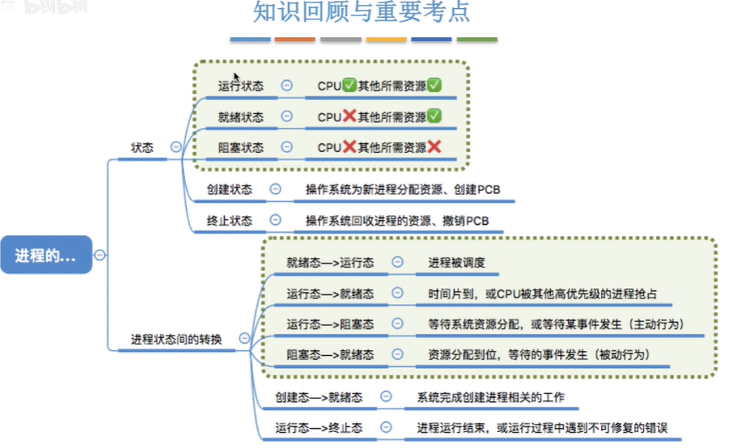

## 进程控制

### 定义

### 如何实现进程控制

名词：原语

### 进程控制相关的原语

#### 进程的创建原语

#### 进程的终止原语

#### 进程的阻塞和唤醒原语

#### 进程的切换

### 知识回顾

## 进程通信

#### 共享存储

#### 消息传递

#### 管道通信

#### 知识回顾

# 线程

## 线程概念

## 线程的实现方式

### 用户级线程 ULT（User-Level Thread）

### 内核级线程（KLT，Kernel-Level Thread）

### 两者结合

### 多线程模型

#### 多对一模型（未懂）

#### 一对一模型

#### 多对多模型

### 知识回顾

# 处理机调度

## 调度的基本概念

## 高级调度（作业调度）

## 中级调度（内存调度）

## 补充：进程的挂起态与七状态模型

## 低级调度（进程调度）

## 三种调度比较

作业调度：进程创建

内存调度：挂起的程序调回内存

进程调度：内存的进程获得 CPU 资源。

## 知识回顾

# 进程调度的时机切换与过程调度方式

## 进程调度的时机

## 进程调度的方式

### 非剥夺调度方式

### 剥夺调度方式

## 进程的切换与过程

### 狭义的进程调度与进程切换的区别

## 知识回顾

# Markdown 转 Xmind 分界线（以下内容不用修改，即可转 Xmind）

### 调度算法的评价指标（父节点：进程调度的时机切换与过程调度方式）

#### CPU 利用率

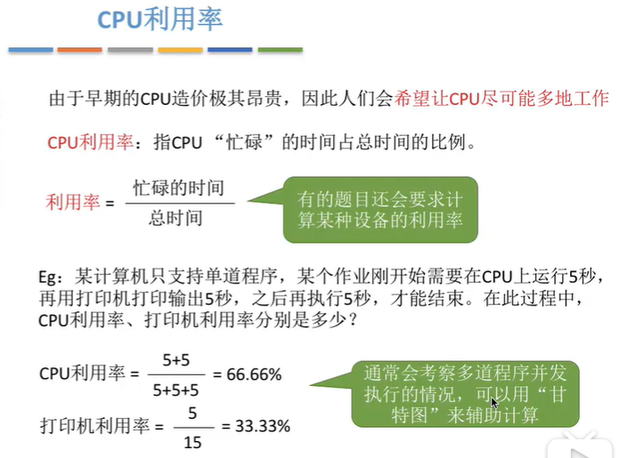

#### 系统吞吐量

#### 周转时间

#### 等待时间

#### 响应时间

#### 知识回顾

## 调度算法

### 先来先服务（FCFS）

### 短作业优先（SJF）

### 两种算法比较

### 高响应比优先

### 知识回顾

### 其他算法

### 时间片轮转

- [此节跳过没看](https://www.bilibili.com/video/BV1YE411D7nH?p=16)

## 进程同步与互斥

### 进程同步定义

由于进程具有异步性：各并发执行的进程以各自独立的、不可预测的速度向前推进。进程同步使得程序运行顺序由我们控制。

### 进程互斥定义

### 知识回顾

### 进程互斥的软件实现方法

#### 单标志法

#### 双标志先检查法

#### 双标志后检查法

#### Peterson 算法

#### 知识回顾

### 进程互斥的硬件实现方法

要求：了解方法的原理和优缺点

#### 中断屏蔽方法

#### TestAndSet 指令

#### Swap 指令

#### 知识回顾

## 信号量机制（P V 操作）

### 整形信号量

### 记录型信号量

#### 知识回顾

### 实现进程互斥（前 P 后 V）

### [实现进程同步（前 V 后 P）](https://www.bilibili.com/video/BV1YE411D7nH?p=21)

#### 进程同步定义

让并发进程按我们想要的顺序执行（并发进程有异步性（代码执行顺序不可预知））。如代码 3 需要在代码 1、2 后执行，而且代码 1，2 是同一个进程，3 为另一个进程。

#### 实现进程同步（前 V 后 P）

### 实现进程的前驱关系

### 知识回顾

## 经典进程同步互斥问题

### [生产者消费者问题](https://www.bilibili.com/video/BV1YE411D7nH?p=22)

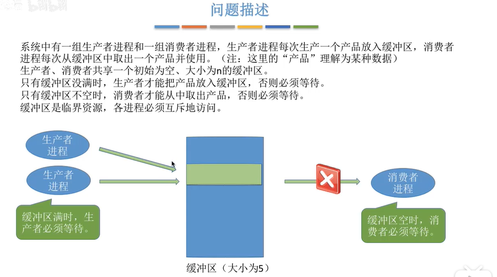

P 减 V 加

#### 知识回顾

### [多生产者-多消费者](https://www.bilibili.com/video/BV1YE411D7nH?p=23)

暂时跳过

### [吸烟者问题](https://www.bilibili.com/video/BV1YE411D7nH?p=24)

跳过

### [读者-写者问题](https://www.bilibili.com/video/BV1YE411D7nH?p=25)

跳过

### [哲学家就餐问题](https://www.bilibili.com/video/BV1YE411D7nH?p=26)

跳过

## [管程](https://www.bilibili.com/video/BV1YE411D7nH?p=27)

### 为什么引入管程

### 管程定义

一种高级同步机制，同信号量用于进程同步和互斥

- 管程的组成：类似于 java 的 class

- 管程的基本特征

1、2：类似于 java 的 private 变量只能由类里的 getter 函数访问

3：一次只能有一个执行，访问缓冲区互斥

### 用管程解决生产中消费者问题

左边伪码是管程原理，右边伪码是我们写代码时用的，这样与用信号量来控制同步与互斥比较很方便。简单说就是管程封装了方法，写代码直接调用。互斥特征由编译器实现。

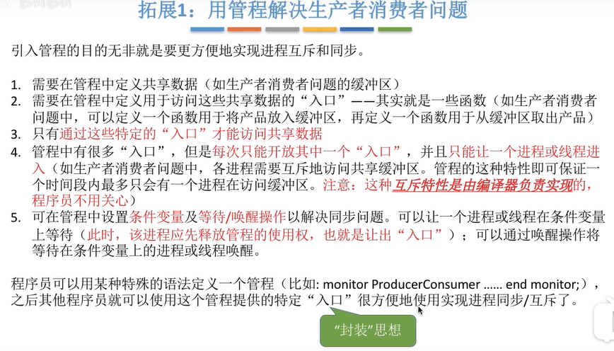

## 死锁

### 死锁的概念

### 死锁、饥饿、死循环的区别

死锁 饥饿 由操作系统管理

### 死锁产生的四个必要条件

#### 互斥条件

#### 请求与保持条件

#### 不可剥夺条件

#### 循环等待条件

### 什么时候发生死锁

### 死锁的处理策略

#### 预防死锁

##### 破坏互斥条件

##### 破坏不可剥夺条件

##### 破坏请求和保持条件

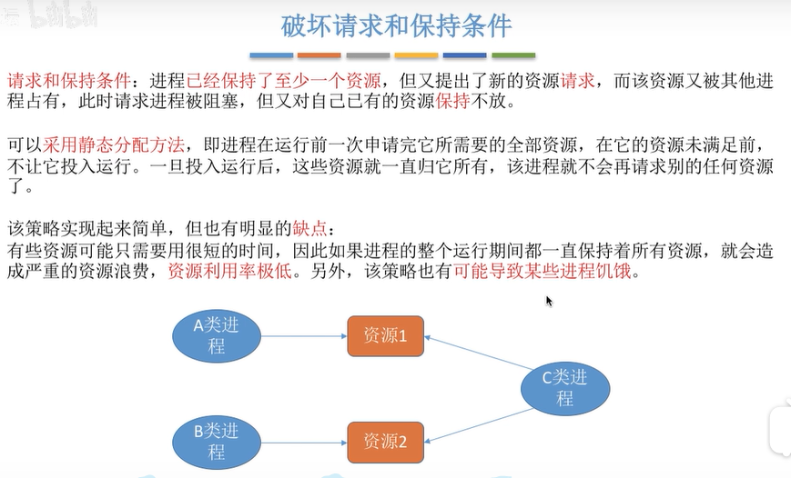

##### 破坏循环等待条件

##### 知识回顾

#### [避免死锁](https://www.bilibili.com/video/BV1YE411D7nH?p=30)

##### 什么是安全序列

##### 安全序列、不安全状态、死锁的联系

##### 银行家算法

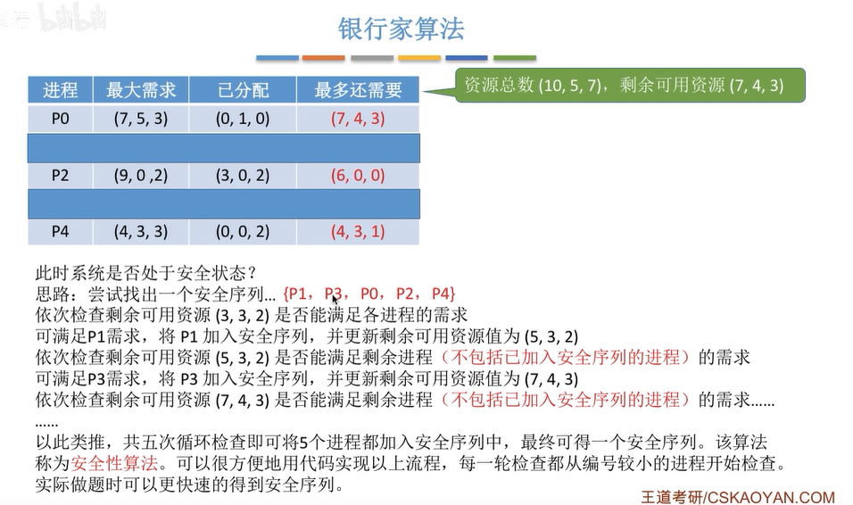

不安全序列：可能发生死锁

- 算法举例

  

##### 知识回顾

#### [检测和解除](https://www.bilibili.com/video/BV1YE411D7nH?p=31)

##### 死锁的检测

看视频更容易理解，截图不完整。

##### 死锁的解除

##### 知识回顾

## 内存

### [内存定义以及作用](https://www.bilibili.com/video/BV1YE411D7nH?p=32&t=29)

### 内存大小

### 指令

#### 逻辑地址 vs 物理地址

### 从写程序到程序运行

#### 装入模块装入内存

##### 装入的三种方式

##### 绝对装入

##### 静态重定位

##### 动态重定位

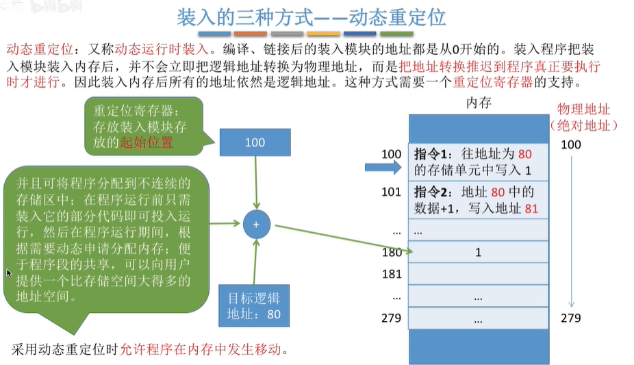

#### 链接的三种方式

### 内存基础知识回顾

### 内存管理的概念

#### 内存空间的分配与回收

#### 内存空间的扩展

#### 地址转换

#### 内存保护

##### 设置一对上、下限寄存器

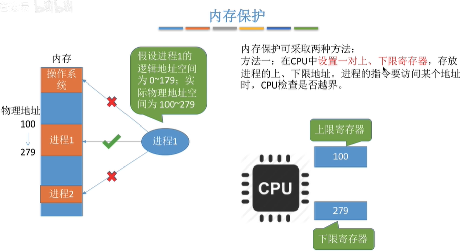

##### 采用重定位寄存器（基址寄存器）和界地址寄存器（限长寄存器）

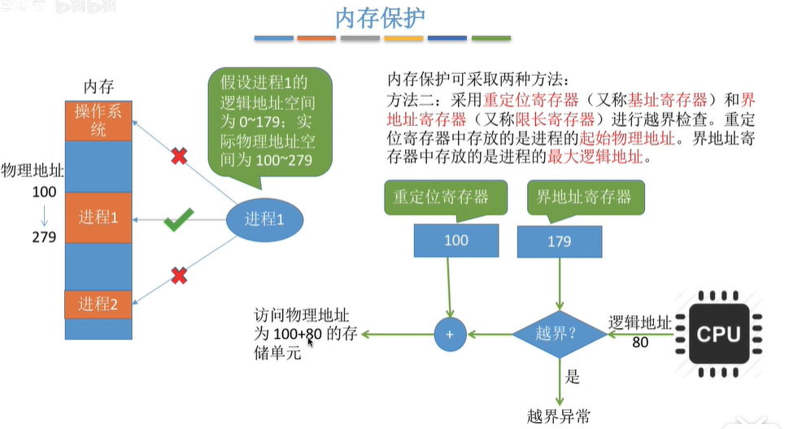

#### 知识回顾

### [覆盖与交换](https://www.bilibili.com/video/BV1YE411D7nH?p=34)

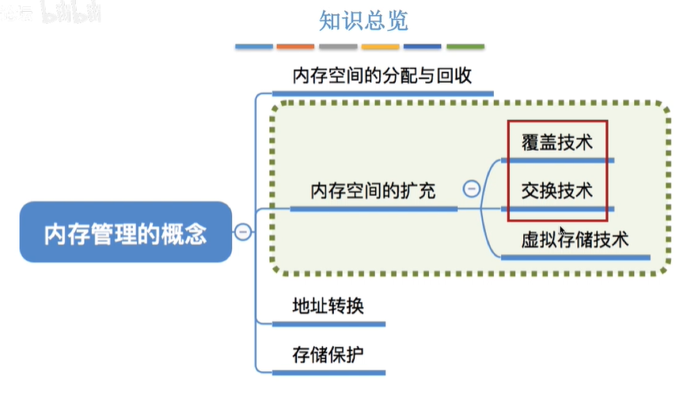

#### 覆盖技术(现在不用此技术)

#### 交换技术

#### 知识回顾

### 连续分配

#### 单一连续分配

#### 固定分区分配

#### 动态分区分配

三个问题

##### 用什么数据结构记录内存使用情况

- 空闲分区表

- 空闲分区链

  

##### 多个空闲分区内存满足程序要求，选择哪个进行分配

##### 如何进行分区的分配和回收操作

### 动态分区分配算法

#### 首次适应算法

查找第一个满足内存需求的。

#### 最佳适应

#### 最坏适应

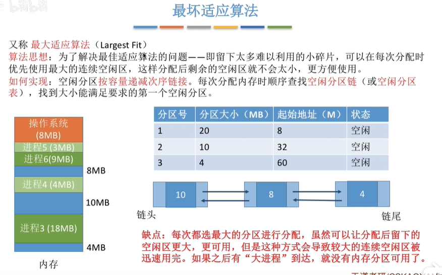

#### 邻近适应

#### 知识回顾

### [基本分页存储管理的基本概念(没太懂)](https://www.bilibili.com/video/BV1YE411D7nH?p=37)

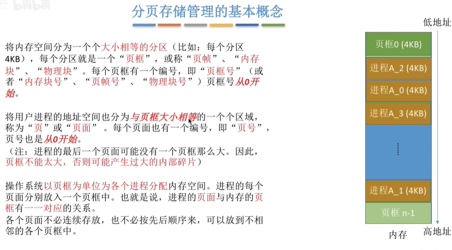

#### 页表

### [基本地址变换机构（没懂 笔记不全）](https://www.bilibili.com/video/BV1YE411D7nH?p=38)

### 没学

https://www.bilibili.com/video/BV1YE411D7nH?p=39

https://www.bilibili.com/video/BV1YE411D7nH?p=40

https://www.bilibili.com/video/BV1YE411D7nH?p=41

https://www.bilibili.com/video/BV1YE411D7nH?p=42

### 虚拟内存的基本概念

### 没学

https://www.bilibili.com/video/BV1YE411D7nH?p=44

https://www.bilibili.com/video/BV1YE411D7nH?p=45

https://www.bilibili.com/video/BV1YE411D7nH?p=46

## 文件管理

### 初识文件管理

### 文件的逻辑结构

#### 无结构文件（流式文件）

#### 有结构文件

##### 顺序文件

##### 索引文件
