# 图解 HTTP

## 第一章 web 基础

### TCP 和 HTTP

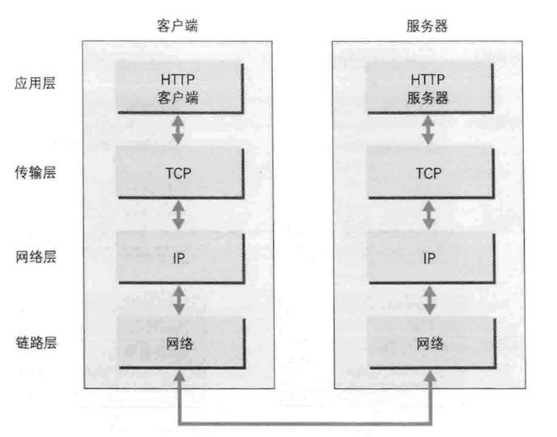

客户端: 应用层 HTTP 传输层 TCP 进行网络传输时用的 TCP 一步一步加那一层的头部

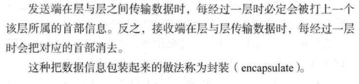

## 第二章 简单的 HTTP 协议

### HTTP 是无状态的协议

增加了 Cookie

### HTTP 方法

- GET

- POST

  表单验证发送数据

- PUT

  传输文件, 用的少 没验证不安全

- HEAD

  简化版的 GET 只获取响应首部

- DELETE

  和 PUT 一样没验证机制 一般少用 除了 RESTful API 那种

- OPTIONS

  询问支持哪些方法 比如 GET POST 等

  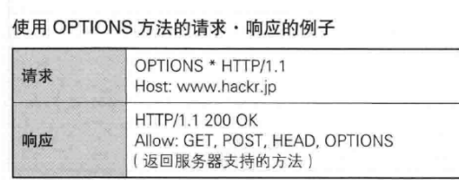

- TRACE

  代理服务器中转一次 MAX-Forwards 次数就减少 1

  少用

- CONNECT

  - 简介

    要求用隧道协议连接代理

    主要使用 SSL TLS 协议把通信内容加密后经网络隧道传输

  - 格式

    CONNECT 代理服务器名: 端口号 HTTP 版本

  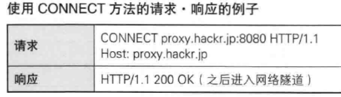

  ### 不同 HTTP 版本支持的方法

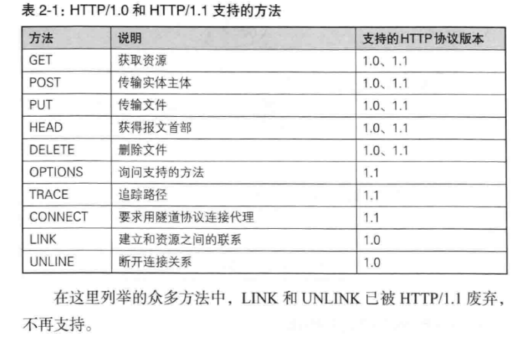

### 持久连接: keep-alive

只要任意一端没明确提出断开连接就保持连接 , 建立一次连接 进行多次 TCP 通信

### Cookie

- Set-Cookie

  服务器发送这个字段, 浏览器保存

下次访问此网站时, 浏览器在请求头中加入 Cookie 字段.

服务器收到 Cookie 后 查询数据库 看看是否是登录状态

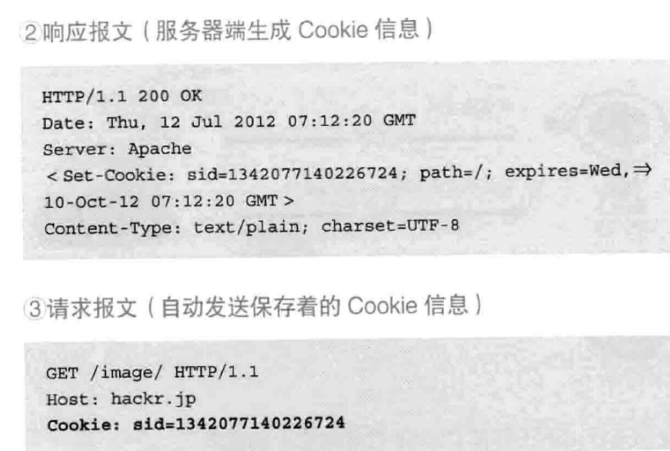

## 第三章 HTTP 报文内的 HTTP 信息

### HTTP 报文

- 组成

  报文首部 报文主体. 由回车符分隔

### 请求报文及响应报文的结构

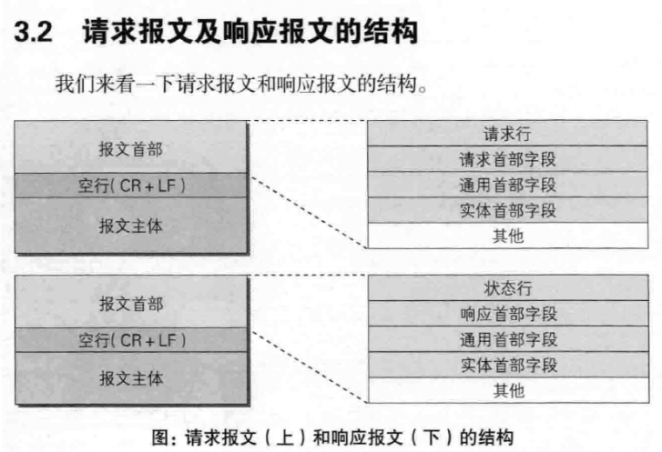

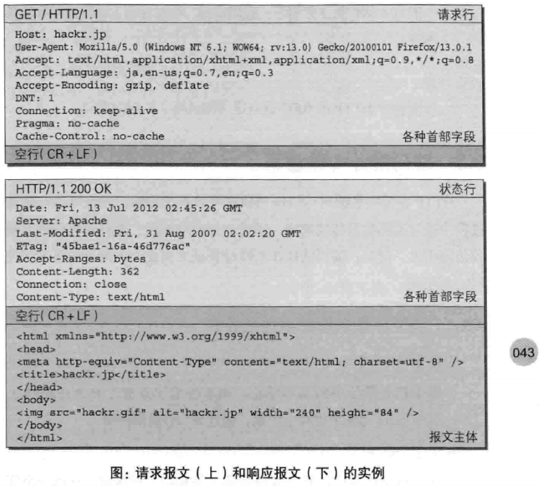

### 压缩

### 分割发送

### 内容协商

- 网页显示语言

  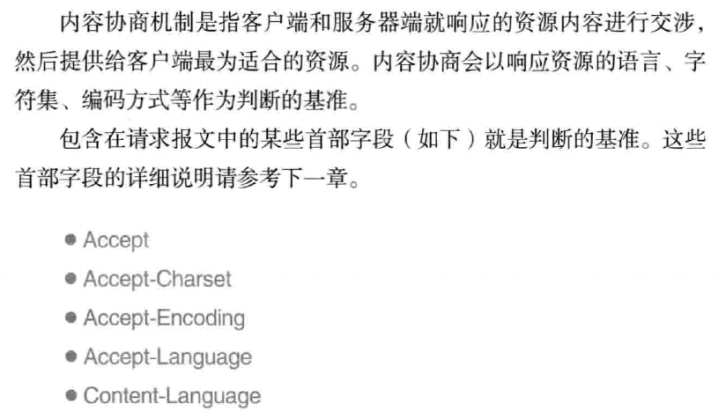

  ## 第四章 返回结果的 HTTP 状态码

  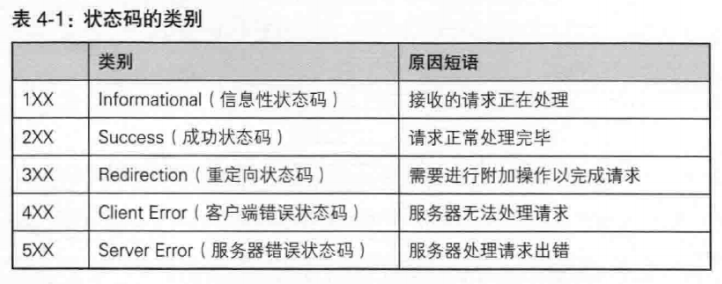

- 200 成功
- 301: 指定路径后面没添加斜杠会 301 重定向

- 401: 未认证
- 401: 禁止访问
- 404: Not Found 或者服务器拒绝访问
- 500: 服务器内部错误
- 503: 服务器忙, 暂时无法处理请求

## 第五章 与 HTTP 协作的 Web 服务器

### 代理 网关 隧道

作用: 通信数据转发

### 透明代理

转发报文时 不做任何加工

### 非透明代理

转发报文时 对报文内容进行加工

## 第六章 HTTP 首部

### 为 Cookie 服务的首部字段

Set-Cookie: 服务器发的.让浏览器设置 Cookie

Cookie: 浏览器

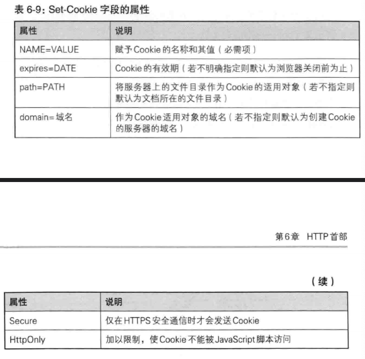

## HTTPS

#### HTTPS 就是身披 SSL 协议的 HTTP

#### SSL 独立于 HTTP, 其他协议也可使用 如 SMTP

HTTP + 加密 + 认证 + 完整性保护 = HTTPS

SSL(Secure Socket Layer): 安全套接层

TLS(Transport Layer Security): 安全层传输协议

中间人攻击: 在请求或响应在传输途中, 遭攻击者拦截并篡改内容的攻击称为中间人攻击(Man-in-the-Middle attack, MITM)

### 加密方法

#### 对称加密

加密解密用同一个密钥, 任何人拿到密钥就能解密

#### 公钥 + 私钥

发送时: 使用对方的公钥加密

接受时: 使用私钥解密

好处:

- 不用发送自己的私钥, 私钥位于计算机本地

- 根据密文和公钥 恢复原文异常困难.(具体算法谷歌)

所以需要保护好私钥, 私钥位于本地, 如果本地电脑被入侵, 别人拿到私钥, 那就不安全了

例子: ssh 登录 linux 服务器

问题: 公钥都一样 能解密的私钥有很多?

#### 客户端证书

银行的网上银行

## 第 8 章 确认访问用户身份的认证

### HTTP 认证方式

- BASIC 认证

  明文密码 不常用

- DIGEST 认证

- SSL 客户端认证

- 基于表单验证

### Session 管理

将 Session id 放置于 Cookie 字段

#### WebSocket

服务器双方都可推送消息 一次建立多重数据可以在同一通信信道里传输

## 第 11 章 Web 的攻击技术

### SQL 注入

### XSS: 跨站脚本攻击

### OS 命令注入攻击

### HTTP 首部注入攻击

### 邮件首部注入攻击

### 目录遍历攻击

### 远程文件包含漏洞
