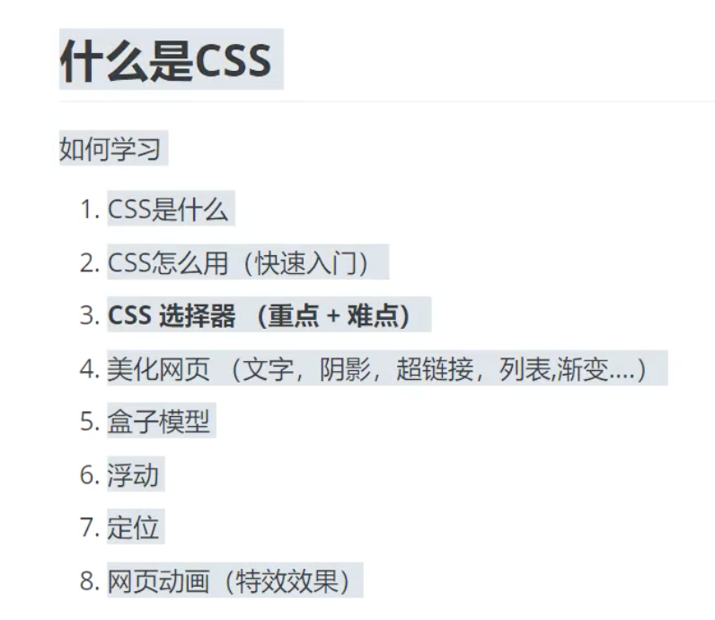
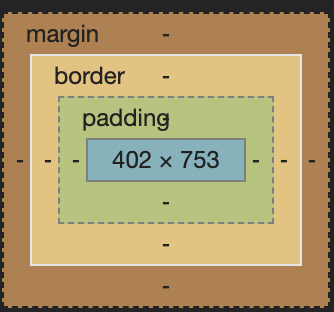

# CSS

参考资料:

[学习 Web 开发-mozilla](https://developer.mozilla.org/zh-CN/docs/learn)

[狂神 CSS](https://www.bilibili.com/video/BV17z4y1D7Yj?p=16)

[渐变 css 模板网站](https://www.grabient.com/)

[CSS 定位详解 - 阮一峰的网络日志](https://www.ruanyifeng.com/blog/2019/11/css-position.html)

## 0. 介绍



## 1. css 3 种引入方法

- 行内样式

  style 标签

  ```html
  <h1 style="color: red">标题2</h1>
  ```

- 内部样式

  定义在 head tag 里的样式

  ```html
  <style>
    h1 {
      color: green;
    }
  </style>
  ```

* 外部样式

  外部文件 引入的 css 文件

  ```html
  <link rel="stylesheet" href="css/style.css" />
  ```

### 优先级

就近原则. (可以与 html 文件加载方式来理解: 从上到下一次加载, 所以近水楼台先得月)

错误的理解: (行内样式 > 内部样式 > 外部样式)

### 外部样式引入方法

- 链接式

  常用

  ```html
  <link rel="stylesheet" href="css/style.css" />
  ```

* 导入式(不建议)

  必须放在 style 标签里面

```html
<style>
  @import url("");
</style>
```

## 2. css 选择器(重点)

选择页面上的某一个或者某一类元素

**重点: 基本选择器 + 属性选择器**

### 2.1 基本选择器

1. 标签选择器

   标签名选择

   选择页面上的指定名字的所有标签

   ```css
   <style>
     h1{
       color: red;
     }
   </style>
   ```

   选中 页面中所有的 h1 标签, 设置颜色为 red

2. 类 class 选择器

   .类名 选取

3. id 选择器

   #id 选取

   id 唯一

#### 优先级

此优先级固定, 不是就近原则

id 选择器 > class 选择器 > 标签选择器

### 2.2 层次选择器(了解即可)

会查询资料使用即可

1. 后代选择器

   在某个元素的后面的所有都选择

   ```css
   body p {
     background: red;
   }
   ```

   body 标签下的所有 p 标签 背景颜色为红色

2. 子选择器

   只选择后面 **一代**, 再后一代以及之后不选择, 儿子选择器

   ```css
   body > p {
     background: red;
   }
   ```

3. 相邻兄弟选择器

   只选择同代的相邻下**一个**元素

   弟弟选择器

   ```css
   /*相邻兄弟选择器*/
   .active + p {
     background: brown;
   }
   ```

4. 通用选择器

   通用选择器 当前选中元素的向下的所有兄弟元素

```css
/*通用选择器 当前选中元素的向下的所有兄弟元素*/
.active ~ p {
  background: brown;
}
```

### 2.3 结构伪类选择器

```html
<!DOCTYPE html>
<html lang="en">
  <head>
    <meta charset="UTF-8" />
    <title>Title</title>
    <style>
      /*避免使用 class id 选择器*/
      ul li:first-child {
        background: red;
      }

      ul li:last-child {
        background: blue;
      }

      /*    选中p1: 定位到父元素 定位第一个元素 *
     */

      /*选中父级元素的第一个元素并且是 p元素才生效.
            需要两个条件: 元素位置对; 元素标签名 对
        */
      p:nth-child(1) {
        background: aquamarine;
      }

      /*选中父元素下第 1 个 p 类型的元素*/
      p:nth-of-type(1) {
        background: black;
      }
    </style>
  </head>
  <body>
    <p>文本1</p>
    <p>文本2</p>
    <p>文本3</p>
    <ul>
      <li>li1</li>
      <li>li2</li>
      <li>li3</li>
    </ul>
  </body>
</html>
```

### 2.4 属性选择器 (常用)

可用正则表达式

id + class 选择器结合

- ```css
      属性名 = 属性值(可用正则表达式, 正则表达式用在等号前)
      =: 绝对等于
      *=: 包含这个元素
      ^=: 以...开头
      $=: 以...结尾
  ```

```html
<!DOCTYPE html>
<html lang="en">
  <head>
    <meta charset="UTF-8" />
    <title>Title</title>

    <style>
      .demo a {
        float: left;
        display: block;
        height: 50px;
        width: 50px;
        /*圆角*/
        border-radius: 10px;
        background: blue;
        /*文字对齐方式*/
        text-align: center;
        color: grey;
        /*下划线去掉*/
        text-decoration: none;
        margin-right: 5px;
        font: bold 20px/50px Arial;
      }

      /*    选中存在id的元素
        属性名 = 属性值(可用正则表达式, 正则表达式用在等号前)
        =: 绝对等于
        *=: 包含这个元素
        ^=: 以...开头
        $=: 以...结尾

    */
      /*a[class*="links"]{*/
      /*    background: yellow;*/
      /*}*/

      /*    选中href中以http开头的元素*/
      /*    a[href^=http]{*/
      /*        background: yellow;*/
      /*    }*/

      /*    以 pdf 结尾*/

      a[href$="pdf"] {
        background: yellow;
      }
    </style>
  </head>
  <body>
    <p class="demo">
      <a href="https://www.baidu.com" class="links item first" id="first">1</a>
      <a
        href="http://google.com"
        class="links item active"
        target="_blank"
        title="test"
        >2</a
      >
      <a href="images/123.html" class="links item">3</a>
      <a href="images/123.png" class="links item">4</a>
      <a href="images/123.jpg" class="links item">5</a>
      <a href="abc">6</a>
      <a href="/a.pdf">7</a>
      <a href="/abc.pdf">8</a>
      <a href="abc.doc">9</a>
      <a href="abcd.doc" class="links item last">10</a>
    </p>
  </body>
</html>
```

## 3. 美化网页元素

### 3.1 标签

#### span

重点的内容通常喜欢用 span 标签

#### div

### 3.2 字体样式

```html
<!DOCTYPE html>
<html lang="en">
  <head>
    <meta charset="UTF-8" />
    <title>Title</title>

    <style>
      body {
        font-family: Arial, serif;
      }
      h1 {
        font-size: 50px;
      }
      .p1 {
        font-weight: bold;
      }
    </style>
  </head>
  <body>
    <h1>故事介绍</h1>

    <p class="p1">
      《红楼梦》，中国古代章回体长篇小说，中国古典四大名著之一，一般认为是清代作家曹雪芹所著。
    </p>
    <p>
      小说以贾、史、王、薛四大家族的兴衰为背景，以富贵公子贾宝玉为视角，以贾宝玉与林黛玉、薛宝钗的爱情婚姻悲剧为主线，
    </p>
    <p>
      描绘了一批举止见识出于须眉之上的闺阁佳人的人生百态，展现了真正的人性美和悲剧美，
    </p>
    <p>
      可以说是一部从各个角度展现女性美以及中国古代社会世态百相的史诗性著作。
    </p>
  </body>
</html>
```

### 3.3 文本样式

1. 颜色 color rgb rgba
2. **文本对齐方式 text-align = center;**
3. **首行缩进 text-indent: 2em;** (1em = 16px)
4. **行高 line-height**: 单行文字上下居中 line-height=height
5. 装饰 text-decoration
6. 文本加图片水平对齐: vertical-align: middle

### 3.4 超链接伪类

a:hover 用得较多

```css
/*鼠标悬浮的颜色*/
a:hover {
  color: orange;
}
/*鼠标左键按住未释放的状态*/
a:active {
  color: green;
}
```

- a:hover
- a:link
- a:visited

### 3.5 阴影

### 3.6 列表

css 代码从外往内写

### 3.7 背景

- 背景颜色

- 背景图片

  ```css
  div {
    width: 1000px;
    height: 700px;
    border: 1px solid red;
    /*默认背景图片平铺*/
    background-image: url("https://i1.hdslb.com/bfs/archive/3a7dfc1a440b1ec8b98701234cded53f54ad8b75.jpg@320w_200h_1c.webp");
  }
  .div1 {
    /*背景水平平铺*/
    background-repeat: repeat-x;
  }
  .div2 {
    /*背景竖直平铺*/
    background-repeat: repeat-y;
  }
  .div3 {
    /*不平铺*/
    background-repeat: no-repeat;
  }
  ```

### 3.8 渐变

渐变 css 模板

https://www.grabient.com/

## 4. 盒子模型

### 4.1 什么是盒子模型



margin: 外边距

boder: 边框

padding: 内边距

### 4.2 边框 border

1. 粗细
2. 样式
3. 颜色

### 4.3 内外边距 margin padding

外边距的妙用: 居中元素

margin + border + padding + 内容 = 盒子模型大小

### 4.4 圆角边框

```html
<!DOCTYPE html>
<html lang="en">
  <head>
    <meta charset="UTF-8" />
    <title>Title</title>
    <style>
      div {
        width: 100px;
        height: 100px;
        border: 10px solid red;
        /*左上 右上 右下 左下 顺时针*/
        border-radius: 50px;
      }
    </style>
  </head>
  <body>
    <div></div>
  </body>
</html>
```

### 4.5 盒子阴影

## 5. 浮动

### 5.1 标准文档流

块级元素: 独占一行

```html
h1~h6 p div li
```

行内元素: 不独占一行

```html
span a img strong ...
```

行内元素可以被包含在块级元素中, 反之不能.

### 5.2 display

多使用 inline-block 既是块元素又是行内元素，不用到 float，简单。

```
block 块元素
inline 行内元素
inline-block 是块元素 但是可以内联在一行
none: 不显示
```

### 5.3 float

1. 左右浮动

清除浮动 clear: both

### 5.4 父级边框塌陷的问题

```css
clear: right; 清除右边的浮动(右边不能有浮动元素 若有, 则排列到下一行)
clear: left;
clear: both; 两侧都不能有浮动
```

父级元素边框塌陷问题: 自己下的定义: 一个 div 中有浮动属性的一张图片 图片的高度大于 div 的高度的情况. 表现为图片显示区域超出 div 的高度.

解决方案:

1. 增加父级元素高度(不建议使用)

2. 增加一个空的 div, 设置此 div css 属性为 clear: both(清除浮动)

3. overflow

   在父级元素中增加一个 overflow: hidden

4. 父类添加一个伪类: after (建议使用)

   和增加一个 空 div 的类似, 优点在于不用在 html 中写 空的 div 标签, 只需要在 css 选择器中加上 :after

   ```
   #father:after{
   		content: "";
   		display: block;
   		clear: both;
   }
   ```

小结:

1. 浮动元素后面增加空的 div

   简单, 需要空的 div

2. 设置父元素的高度

   简单, 元素有固定高度, 就会被限制

3. overflow

   简单, 下拉的一些场景避免使用.用户体验不好

4. 父类后增加一个**伪类** after(推荐使用)

   写法复杂一点点, 无其他缺点

### 5.5 对比

- display

  方向不可以控制, 没有父级边框塌陷问题

- float

  浮动起来会脱离标准文档流, 需要解决父级边框塌陷问题.

## 6. 定位

### 6.1 相对定位

position: relative;

相对自己原来的位置, 进行指定的偏移, 相对定位, 它仍然在标准文档流中, 原来的位置会被保留.

### 6.2 绝对定位

绝对定位: 基于 XX 定位

1. 没有父级元素定位的前提下, 相对于浏览器定位.
2. 假设父级元素存在定位, 通常会相对于父级元素进行偏移

```html
<!DOCTYPE html>
<html lang="en">
  <head>
    <meta charset="UTF-8" />
    <title>Title</title>
    <style>
      div {
        margin: 10px;
        padding: 5px;
        font-size: 12px;
        line-height: 25px;
      }
      #father {
        background-color: brown;
        border: 1px solid red;
        padding: 0;
        position: relative;
      }

      #first {
        background-color: orange;
        border: 1px dashed black;
      }

      #second {
        background-color: green;
        border: 1px dashed blue;
        position: absolute;
        right: 30px;
        top: -10px;
      }

      #third {
        background-color: #0093e9;
        border: 1px dashed orange;
      }
    </style>
  </head>
  <body>
    <div id="father">
      <div id="first">第1个盒子</div>
      <div id="second">第2个盒子</div>
      <div id="third">第3个盒子</div>
    </div>
  </body>
</html>
```

### 6.3 固定定位 fixed

```HTML
<!DOCTYPE html>
<html lang="en">
<head>
    <meta charset="UTF-8">
    <title>Title</title>
    <style>
        body{
            height: 1000px;
        }
        div:nth-of-type(1){
            width: 100px;
            height: 100px;
            background-color: red;
            /*绝对定位*/
            position: absolute;
            right: 0;
            bottom: 0;
        }

        div:nth-of-type(2){
            width: 50px;
            height: 50px;
            background-color: yellow;
            /*固定定位*/
            position: fixed;
            right: 0;
            bottom: 0;
        }
    </style>
</head>
<body>


<div>div1</div>
<div>div2</div>
</body>
</html>
```

### 6.4 z-index

图层

层级 z-index, 数字越大越在上层, 下层的会被上层的覆盖

## 7. 动画

css 动画 谷歌搜素材

关键词 canvas 和 javascript, 用 js 做动画的更多.

## 8. 总结
