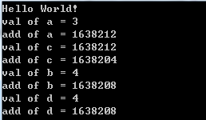

# C 语言

## 函数

C 源码文件分开写: _.h _.c main.c

### \*.h

头文件, 包括以下内容

#define

typedef

#include(\*.c 也有)

函数定义

### \*.c

用 #include "\*.h" 将头文件引入进来

然后写头文件中函数的实现

### main.c

用 #include "\*.h" 将头文件引入进来

然后可以调用 \*.c 中的函数

### 理解

都只有用 #include 引用头文件

头文件 .h 是 .c . main.c 之间的桥梁. main.c 引用了对应的头文件, 才能调用  .c 中具体的实现函数.

\*.h 类似于 Java 中接口(interface)

\*.c 类似于具体实现(impl)

main.c 就是具体的调用

## 数组

### 定义

datatype arrayname[arrayamount];

例子

```c
int array1[23]
```

```c
double array2[12];
```

## 指针

### 定义

**指针** 是一个变量，其值为另一个变量的地址，即，内存位置的直接地址。

指针变量声明的一般形式为：

```
type *var-name;
```

指针声明例子:

```c
int    *ip;    /* 一个整型的指针 */
double *dp;    /* 一个 double 型的指针 */
float  *fp;    /* 一个浮点型的指针 */
char   *ch;     /* 一个字符型的指针 */
```

### 如何使用指针？

使用指针时会频繁进行以下几个操作：

1. 定义一个指针变量

2. 把变量地址赋值给指针

3. 访问指针变量中可用地址的值

这些是通过使用一元运算符 **\*** 来返回位于操作数所指定地址的变量的值。下面的实例涉及到了这些操作：

```C
#include <stdio.h>

int main ()
{
   int  var = 20;   /* 实际变量的声明 */
   int  *ip;        /* 指针变量的声明 */

   ip = &var;  /* 在指针变量中存储 var 的地址 */

   printf("Address of var variable: %p\n", &var  );

   /* 在指针变量中存储的地址 */
   printf("Address stored in ip variable: %p\n", ip );

   /* 使用指针访问值 */
   printf("Value of *ip variable: %d\n", *ip );

   return 0;
}
```

#### 理解

看上面的例子

1. 指针变量声明用 \* 运算符. 这个变量用来存储内存地址

   ```c
      int  *ip;        /* 指针变量的声明 */
   ```

2) 指针变量的赋值(存入地址到指针变量中). 用 &符号取变量的地址, 再赋值给指针变量

   ```c
      ip = &var;  /* 在指针变量中存储 var 的地址 */
   ```

   此时 指针变量 ip 就存入了 变量 var 的地址

3) 指针的操作

   1. 直接访问指针的值(即为访问指针指向的变量的地址), 所以和用 &变量名 结果一样. 即: ip=&var. 也就是和赋值给指针的语句一样

      ```c
         printf("Address of var variable: %p\n", &var  );

         /* 在指针变量中存储的地址 */
         printf("Address stored in ip variable: %p\n", ip );
      ```

   2. 通过指针访问它指向的变量

      使用 \*ip 即可

      即:

      \*ip 和 var 一样

   总结:

   1. 使用 \*p 声明指针变量
   2. 使用 p= &var 给指针变量赋值(注意此时没有 \* 号 )
   3. 使用 \*p 访问变量 var, 也可以修改此变量

### 指针数组

https://www.runoob.com/cprogramming/c-array-of-pointers.html

数组传入函数时, 是传的第一个元素的地址(指针)

### 指向指针的指针

### 传递指针给函数

```c
#include <stdio.h>

void pointer_function(int *p){
    *p=233333;
}

void common_function(int i){
    printf("var is %d\n", i);
}

int main ()
{
    int var = 1;
    int *p;
    p=&var;

    common_function(var);
    common_function(*p);

    pointer_function(p);

    common_function(var);
    common_function(*p);

    return 0;
}
```

总结:

### 从函数返回指针

执行结果

```C
Address of var variable: bffd8b3c
Address stored in ip variable: bffd8b3c
Value of *ip variable: 20
```

## C 结构体

### 定义结构

```C
struct tag {
    member-list
    member-list
    member-list
    ...
} variable-list ;
```

实例

```C
struct Books
{
   char  title[50];
   char  author[50];
   char  subject[100];
   int   book_id;
} book;
```

几种声明方式

```C
//此声明声明了拥有3个成员的结构体，分别为整型的a，字符型的b和双精度的c
//同时又声明了结构体变量s1
//这个结构体并没有标明其标签
struct
{
    int a;
    char b;
    double c;
} s1;

//此声明声明了拥有3个成员的结构体，分别为整型的a，字符型的b和双精度的c
//结构体的标签被命名为SIMPLE,没有声明变量
struct SIMPLE
{
    int a;
    char b;
    double c;
};
//用SIMPLE标签的结构体，另外声明了变量t1、t2、t3
struct SIMPLE t1, t2[20], *t3;

//也可以用typedef创建新类型
typedef struct
{
    int a;
    char b;
    double c;
} Simple2;
//现在可以用Simple2作为类型声明新的结构体变量
Simple2 u1, u2[20], *u3;
```

### 总结

结构体和 Java 中的类相似(多数操作都能对应上):

tag 为类名

variable-list 为对象名

可以在定义 variable-list 的时候赋值

```java
class Tag{
  	member-list
    member-list
    member-list
    ...
}

Tag variable-list = new Tag();
```

1. 结构体声明

```C
struct tag {
    member-list
    member-list
    member-list
    ...
} variable-list ;
```

2. 结构体变量定义, 变量可为指针, 数组, 普通变量, 上面的 variable-list 是在结构体定义时声明的

```C
struct tag 变量;
```

如果像一中声明了结构体变量, 可以用如下声明结构体变量

```C
variable-list 变量
```

### 包含指向结构体本身的指针

结构体的成员可以包含其他结构体，也可以包含指向自己结构体类型的指针，而通常这种指针的应用是为了实现一些更高级的数据结构如链表和树等。

```C
//此结构体的声明包含了其他的结构体
struct COMPLEX
{
    char string[100];
    struct SIMPLE a;
};

//此结构体的声明包含了指向自己类型的指针
struct NODE
{
    char string[100];
    struct NODE *next_node;
};
```

### 指向结构的指针

您可以定义指向结构的指针，方式与定义指向其他类型变量的指针相似，如下所示：

```c
struct Books *struct_pointer;
```

现在，您可以在上述定义的指针变量中存储结构变量的地址。为了查找结构变量的地址，请把 & 运算符放在结构名称的前面，如下所示：

```C
struct_pointer = &Book1;
```

为了使用指向该结构的指针访问结构的成员，您必须使用 -> 运算符，如下所示：

```C
struct_pointer->title;
```

## C typedef: 取别名

typedef 原名 别名

定义后可以用别名代替原名

数据结构中用 typedef 很多

```C
#include <stdio.h>
#include <string.h>

typedef struct Books
{
   char  title[50];
   char  author[50];
   char  subject[100];
   int   book_id;
} Book;

int main( )
{
   Book book;

   strcpy( book.title, "C 教程");
   strcpy( book.author, "Runoob");
   strcpy( book.subject, "编程语言");
   book.book_id = 12345;

   printf( "书标题 : %s\n", book.title);
   printf( "书作者 : %s\n", book.author);
   printf( "书类目 : %s\n", book.subject);
   printf( "书 ID : %d\n", book.book_id);

   return 0;
}
```

### typedef vs #define

**#define** 是 C 指令，用于为各种数据类型定义别名，与 **typedef** 类似，但是它们有以下几点不同：

- **typedef** 仅限于为类型定义符号名称，**#define** 不仅可以为类型定义别名，也能为数值定义别名，比如您可以定义 1 为 ONE。
- **typedef** 是由编译器执行解释的，**#define** 语句是由预编译器进行处理的。

## 链表

# 彻底搞定 C 指针笔记

## 第壹篇 变量的内存实质

指针变量所存的内容就是**内存的地址编号**

输出内存地址

用 %x

```c
printf("%x", &i);
```

## **第贰篇 指针是什么？**

1. 指针声明

```c
int *pi
```

2. 指针赋值

```c
pi = &i // 赋值时指针前面没有 * 号
```

3. 用指针访问变量

```c
printf("%d", *pi);
```

等价于

```c
printf("%d", i)
```

## 第叁篇 指针与数组名

### 通过数组名访问数组元素

数组是传的指针

**数组名其实也就是指针**

```c
int i, a[] = {3,4,5,6,7,3,7,4,4,6};
for (i = 0; i <= 9; i++)
{
  printf("%d\n", a[i]);
  printf("%d\n", *(a+i));
}
```

a[i] 等价 \*(a+i)

### **数组名与指针变量的区别**

指针是指针变量，而**数组名只是一个指针常量**

数组名是指针常量，其值是不能修改的，因此不能类似这样操作：a++。而指针变量可以修改.

### **声明指针常量**

```c
int *const pa = a; /* 注意 const 的位置：不是 const int *pa */
```

## **第伍篇 函数参数的传递**

C 语言中函数参数的传递有：值传递、地址传递、引用传递

这三种形式。

题一为值传递(形参实参)，题二为地址传递(传指针)，题三为引用传递()

#### 值传递

比较好理解 无比几

#### 地址传递

继续！地址传递的问题！

看考题二的代码：

```c
void Exchg2(int *px, int *py)

{

    int tmp = *px;

    *px = *py;

    *py = tmp;

    printf("*px = %d, *py = %d.\n", *px, *py);

}

main()

{

    int a = 4;

    int b = 6;

    Exchg2(&a, &b);

    printf("a = %d, b = %d.\n”, a, b);

    return(0);

}
```

它的输出结果是：

*px = 6, *py = 4.

a = 6, b = 4.

看函数的**接口**部分：Exchg2(int *px, int *py)，请注意：参数 px、

26py 都是指针。

再看调用处：Exchg2(&a, &b);

它将 a 的地址（&a）代入到 px，b 的地址（&b）代入到 py。同上面的值

传递一样，函数调用时作了两个隐含的操作：将&a，&b 的值赋值给了 px、py。

px = &a;

py = &b;

呵呵！我们发现，其实它与值传递并没有什么不同，只不过这里是将 a、b

的地址值传递给了 px、py，而不是传递的 a、b 的内容，而（请好好地在比较

比较啦）整个 Exchg2 函数调用是如下执行的：

px = &a; /_ ← _/

py = &b; /_ ← 请注意这两行，它是调用 Exchg2 的隐含动作。_/

int tmp = \*px;

*px = *py;

\*py = tmp;

printf("*px =%d, *py = %d.\n", *px, *py);

**这样，有了头两行的隐含赋值操作。我们现在已经可以看出，指针** **px\*\***、\***\*py**

**的值已经分别是** **a\*\***、\***\*b** **变量的地址值了。接下来，对\*\*\***px\***\*、\*\*\***py\*\* **的操作当然也就**

**是对** **a\*\***、\***\*b** **变量本身的操作了。**所以函数里头的交换就是对 a、b 值的交换了，

这就是所谓的地址传递（传递 a、b 的地址给了 px、py），你现在明白了吗？

### 引用传递

**x、y 分别引用了** **a**、**b** **变量。**

#### 引用传递和值传递区别

1）在函数定义格式上有不同：

值传递在定义处是：Exchg1(int x, int y);

引用传递在这义处是：Exchg3(int &x, int &y);

2）调用时有相同的格式：

值传递：Exchg1(a, b);

引用传递：Exchg3(a, b);

3）功能上是不同的：

值传递的函数里操作的不是 a、b 变量本身，只是将 a、b 值赋给了 x、y。

函数里操作的只是 x、y 变量而不是 a、b，显示 a、b 的值不会被 Exchg1 函数

所修改。

引用传递 Exchg3(a, b)函数里是用 a、b 分别代替了 x、y。函数里操作

的就是 a、b 变量的本身，因此 a、b 的值可在函数里被修改的。

### 引用传递 和 指针传递 的区别

来源: https://www.cnblogs.com/chen-kh/p/6696305.html

这个理解起来更简单，我们这样理解引用，引用是变量的一个别名，调用这个别名和调用这个变量是完全一样的。

所以 swap2 的结果可以解释。值得注意的是，由于引用时别名，所以引用并不是一种数据类型，内存并不会给它单独分配内存，而是直接调用它所引用的变量。

这个与地址传递也就是指针是不一样的（也就是说一个指针虽然指向一个变量，但是这个指针变量在内存中是有地址分配的），下面代码进行验证。

```c
 1 void main(){
 2     printf("Hello World!\n");
 3     int a = 3;
 4     int b = 4;
 5     int* c = &a;//c是指向a的指针
 6     int& d = b;//d是b的引用，alias of b = d
 7     printf("val of a = %d\n",a);
 8     printf("add of a = %d\n",&a);
 9     printf("val of c = %d\n",c);
10     printf("add of c = %d\n",&c);
11     printf("val of b = %d\n",b);
12     printf("add of b = %d\n",&b);
13     printf("val of d = %d\n",d);
14     printf("add of d = %d\n",&d);
15 }
```

输出结果：



我们看到 c 的值是 a 的地址，c 的地址是单独分配的；而 d 的值是 b 的值，d 的地址是 b 的地址！

## **第陆篇 指向另一指针的指针**

貌似不常用到, 好难学..

## **第柒篇 函数名与函数指针**

就象某一数据变量的内存地址可以存储在相应的指针变量中一样，函数的

首地址也以存储在某个函数指针变量里的。这样，我就可以通过这个函数指针变

量来调用所指向的函数了。

#### 函数指针变量声明

以上面的例子为例，我

来声明一个可以指向 MyFun 函数的函数指针变量 FunP。下面就是声明 FunP

变量的方法：

void (_FunP)(int) ; /_ 也可写成 void (_FunP)(int x)_/

你看，整个函数指针变量的声明格式如同函数 MyFun 的声明处一样，

只不过——我们把 MyFun 改成“(\*FunP)”而已，这样就有了一个能指向 MyFun

函数的指针 FunP 了。（当然，这个 FunP 指针变量也可以指向所有其它具有相

同参数及返回值的函数了。）

### **通过函数指针变量调用函数**

有了 FunP 指针变量后，我们就可以对它赋值指向 MyFun，然后通过 FunP

来调用 MyFun 函数了。看我如何通过 FunP 指针变量来调用 MyFun 函数的：

/_ 自行包含头文件 _/

void MyFun(int x); /_ 这个声明也可写成：void MyFun( int )_/

void (*FunP)(int ); /*也可声明成 void(\*FunP)(int x)，但习

惯上一般不这样。 \*/

int main(int argc, char\* argv[])

{

38MyFun(10); /_ 这是直接调用 MyFun 函数 _/

FunP = &MyFun; /_ 将 MyFun 函数的地址赋给 FunP 变量 _/

(_FunP)(20); /_ （★）这是通过函数指针变量 FunP 来调用

MyFun 函数的。 \*/

}

void MyFun(int x) /_ 这里定义一个 MyFun 函数 _/

{

printf("%d\n",x);

}

请看（★）行的代码及注释。

运行看看。嗯，不错，程序运行得很好。

哦，我的感觉是：MyFun 与 FunP 的类型关系类似于 int 与 int \* 的关

系。函数 MyFun 好像是一个如 int 的变量（或常量），而 FunP 则像一个如 int

\* 一样的指针变量。

int i,\*pi;

pi = &i; /_ 与 FunP = &MyFun 比较。_/

（你的感觉呢？）

呵呵，其实不然……

### **调用函数的其它书写格式**

**1\*\***）其实，\***\*MyFun** **的函数名与** **FunP** **函数指针都是一样的，即都是函数指针。**

**MyFun** **函数名是一个函数指针常量，而** **FunP** **是一个函数数指针变量，这是它**

**们的关系。**

**2\*\***）但函数名调用如果都得如\***\*(\*MyFun)(10)\*\***这样，那书写与读起来都是不\*\*

**方便和不习惯的。所以** **C** **语言的设计者们才会设计成又可允许** **MyFun(10)\*\***这种\*\*

**形式地调用（这样方便多了并与数学中的函数形式一样，不是吗？）。**

**3\*\***）为统一起见，\***\*FunP** **函数指针变量也可以** **FunP(10)\*\***的形式来调用。\*\*

**4\*\***）赋值时，即可\*\* **FunP = &MyFun** **形式，也可** **FunP = MyFun\*\***。\*\*

上述代码的写法，随便你爱怎么着！

请这样理解吧！这可是有助于你对函数指针的应用喽！

最后 ——

补充说明一点，在函数的声明处：

void MyFun(int); /*不能写成 void (*MyFun)(int)。\*/

void (\**FunP)(int); /*不能写成 void FunP(int)。\*/

（请看注释）这一点是要注意的。

## **定义某一函数的指针类型**

感觉暂时用不到, 后面再补充

## **函数指针作为某个函数的参数**
