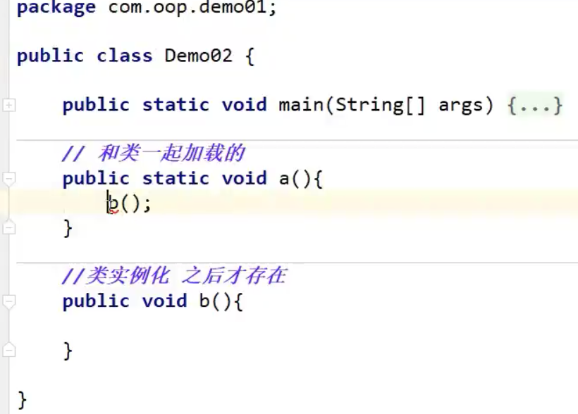
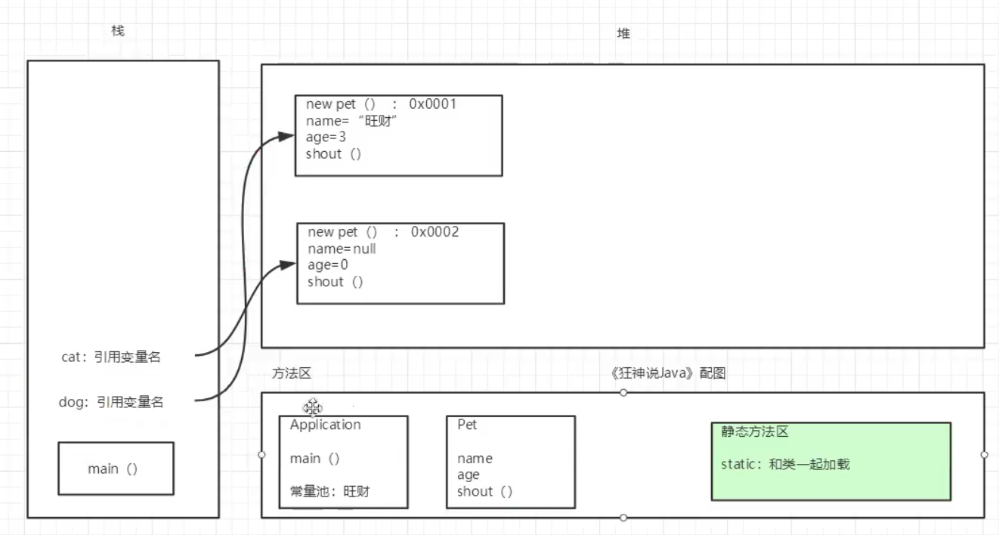
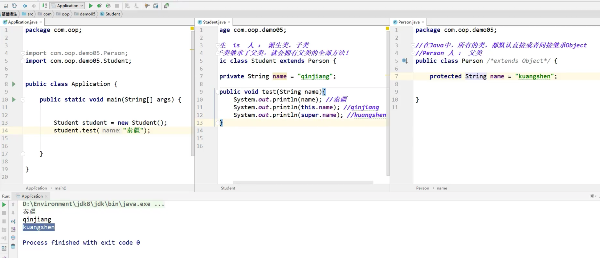
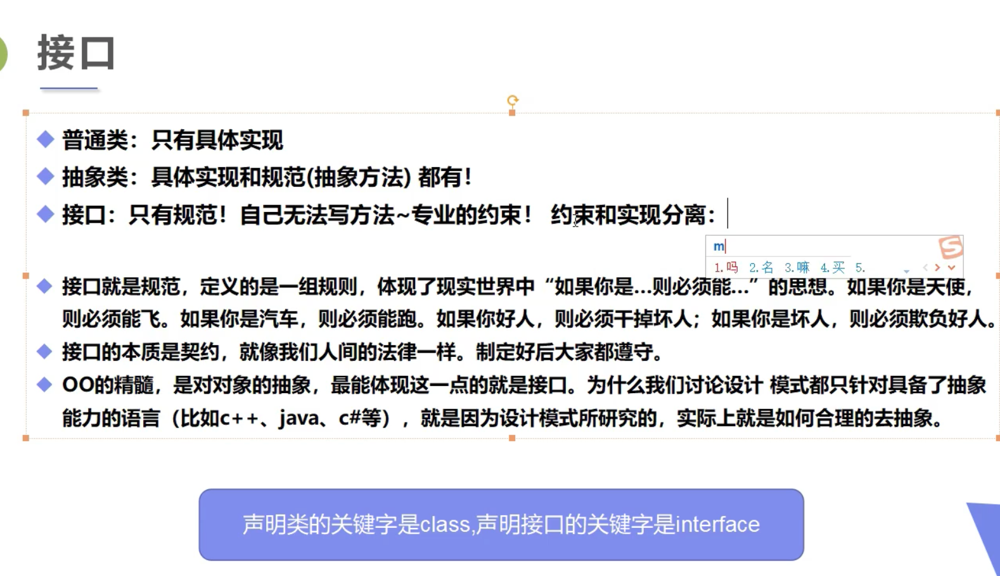

# Java 基础

## 代码

Java/JavaProgrammingBasics

## 视频地址

[【狂神说 Java】Java 零基础学习视频通俗易懂](https://www.bilibili.com/video/BV12J41137hu)

## P16 入门 04 JDK JRE JVM

JDK: Java 开发环境

JRE: 运行环境

JVM: Java 虚拟机

JDK 包含 JRE

JRE 包含 JVM

通过 JVM 实现跨平台

## P19 编译型和解释型

- 编译型

  一次性翻译完 再读 执行速度快些

- 解释型

  读一句翻译一句 执行速度慢些

## IDEA 快捷键

- sout = System.out.println();
- psvm = Java 类中的 main 方法

## 注释

平时写代码一定要写注释

- 单行注释

  //

- 多行注释

  /\* 回车

- Java doc 文档注释

  /\*\* 回车

## 数据类型

- 强类型语言

  要求变量的使用要严格符合规定, 所有变量都必须先定义再使用

- 弱类型语言

### 数据类型分类

- 八大基本类型

  int float double char boolean 等

- 引用类型

  类 String Byte 等

  接口

  数组

### 字节

- 位(bit)

  计算机 内部数据 储存的最小单位 1100 1100 为 八位 二进制数. 二进制数有多少位就几个位

- 字节(byte)

  计算机中 数据处理 的基本单位 习惯用大写 B 表示

  1B(byte) = 8bit(位)

- 字符

### 整数扩展

### 转义字符

- \t

  Tab 键

- \n

  回车键

## 类型转换

- 强制类型转换
  - 不能对 bool 类型转换
  - 不能把对象类型转换位不相干的类型
  - 在把高容量转到低容量的时候 强制转换
  - 可能有内存溢出 或者 精度问题
  -
- 自动类型转换

## IDEA 快捷输入

100.for: for 循环快捷键

main: 主方法

new Scanner(System.in); 然后 alt + enter 会补充前面的对象.new 其他对象是一样的.

sout: System.out.printline();

## break 和 countine

用于循环结构

break: 退出当前循环, 直接退出循环程序

countine: 退出当前小循环, 进入下一个循环

## 方法重载

一个类中多个同名方法 参数 返回值可不同

## 命令行传参 和 可变参数

## 递归

## 数组

### Array 类

看源码

### 稀疏数组

## 面向对象编程

- 封装
- 继承
- 多态

### 静态方法

调用: 类名.方法名

### 非静态方法

只能先 new 类 在调用



static 中的方法不能调用非 static 的方法

### 创造对象内存分析

- new 一个对象的时候会在 堆中放入对象的数据 在栈中生成对象名字------>指向 堆中对应的对象(指针, 地址), 是引用传递

  

### 封装

属性私有 private 和 get set 方法

### 重载

多个同名方法 参数或者返回类型不同

### 继承

- 只有单继承

- 子类继承父类的所有 属性 和 公共方法(私有方法不继承)
- Java 中 所有类都继承或间接继承 Object 类 所以会有一些自带方法
- super

  - super 调用父类构造方法 必须在构造方法的第一个
  - super 必须只能出现在子类的方法或构造方法中
  - super 和 this 不能同时调用构造方法

- this 和 super

  - 对象:

    this 本身调用者这个对象

    super: 代表父类对象

  - 前提:

    this: 没有继承也可以使用

    super: 只能在继承条件才可以使用

  - 构造方法

    this: 本类的构造

    super: 父类的构造



- 方法重写

  需要有继承关系, 子类重写父类的方法

  1. 方法名相同
  2. 参数相同
  3. 修饰符 范围可以扩大不能缩小. Public > proctect > default> private
  4. 抛出的异常 可以缩小 不能扩大 ClassNotFoundException(小) -->Exception(大)

- 多态
  - 方法的多态
  - 父类和子类有关系, 否则会类型转换异常
  - 存在条件: 继承关系 方法需要重写 父类引用指向子类对象

### Java 值传递

java 是值传递: 复制一分参数给函数

对象是引用传递(指针)

### static 关键字

静态方法和变量 和类一起加载, 能直接调用 不用新建对象.

其他非静态的变量和方法必须先 new 对象后使用

记住这句话就会使用了

- 被 final 修饰的类 不能被继承

#### static 静态代码块

只执行一次

```java
static{
  方法
}
```

#### 静态导入包

### 抽象类

- 类/方法 上使用 abstract 关键字, 只有方法/类的名字 没有实现
- 一个类中有 抽象方法就必须声明为抽象类 抽象类中可以有普通方法

### 接口

- 接口仅定义方法. 不实现

- 利用接口实现多继承



- 接口作用
  - 1. 约束
    2. 定义一些方法, 让不同人实现
    3. 方法都是 public abstract
    4. 接口不能被实例化, 没有构造方法
    5. implements 可以实现多个接口
    6. 必须要重写接口中的方法

## 异常机制

### Error 和 Exception

Error: 致命

Exception: 可处理

### 捕获异常

- 关键字

  try catch finally throw throws

- 捕获多个异常 由上到下 异常范围由小到大

- throw

  主动抛出异常, 一般在方法中使用, 假设在方法中不能处理异常

### 自定义异常
