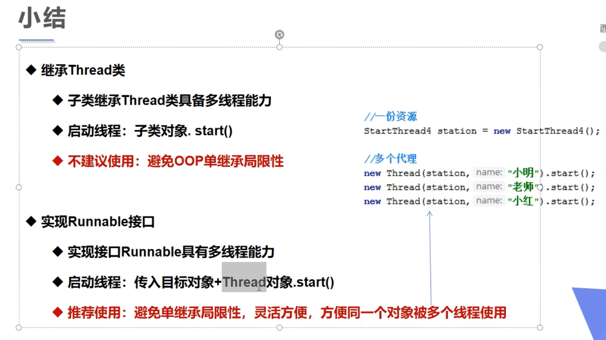
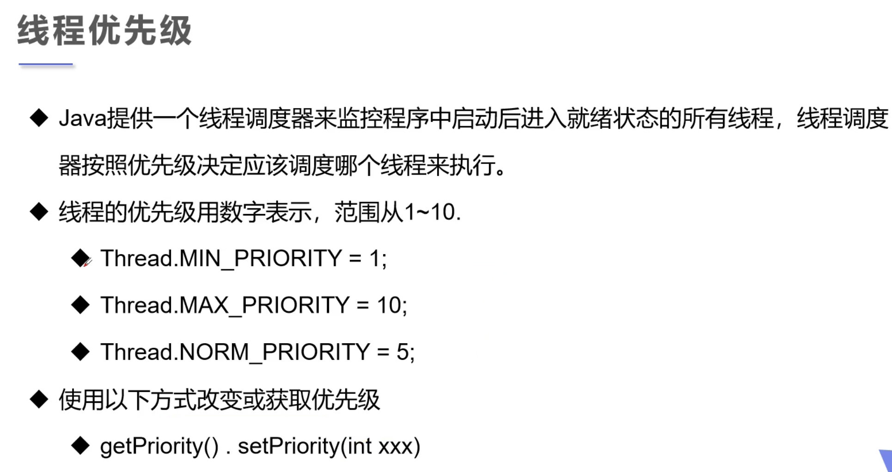
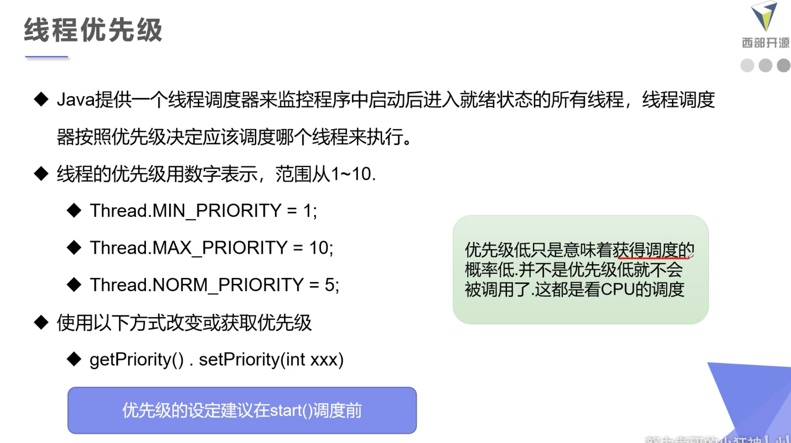
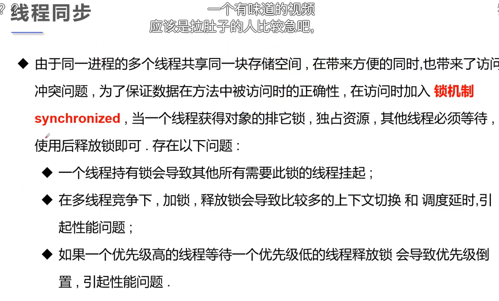

# 多线程

[【狂神说 Java】多线程详解](https://www.bilibili.com/video/BV1V4411p7EF)

## 方法 1: 继承 Thread 类 重写 Run 方法

- 自定义线程类继承 Thread 类

- 重写 run 方法, 编写线程执行体

- 创建线程对象, 调用 start 方法启动线程

  ```java
  package Demo01;

  /*
  - 自定义线程类继承Thread类
  - 重写run方法, 编写线程执行体
  - 创建线程对象, 调用start 方法启动线程
   */

  public class TestThread1 extends Thread{
      @Override
      public void run() {
          //run方法线程体
          for (int i = 0; i < 200; i++) {
              System.out.println("我在看代码" + i);
          }
      }

      public static void main(String[] args) {
          //main方法 主线程

          //创建一个线程对象
          TestThread1 testThread1 = new TestThread1();

          //调用start方法开启线程
          testThread1.start();
  //        testThread.run();

          for (int i = 0; i < 10000; i++) {
              System.out.println("我在学习多线程---" + i);
          }
      }
  }
  ```

## 方法 2(推荐): 实现 Runnable 接口 实现 Run 方法

- 实现接口 Runnable

  ```java
  public class Runnable implements java.lang.Runnable
  ```

- 重写 run 方法

  ```java
  @Override
  public void run() {
      //run方法线程体
      for (int i = 0; i < 200; i++) {
          System.out.println("我在看代码" + i);
      }
  }
  ```

- new 实现类的对象

  ```java
  Runnable testThread3 = new Runnable();
  ```

- 将这个 new 出来的实现类对象放入 Thread 类的构造函数然后用 start 方法

  ```java
  new Thread(testThread3).start();
  ```

```java
package Demo01;

public class Runnable implements java.lang.Runnable {
    @Override
    public void run() {
        //run方法线程体
        for (int i = 0; i < 200; i++) {
            System.out.println("我在看代码" + i);
        }
    }

    public static void main(String[] args) {
        // 创建Runnable接口的实现类对象
        Runnable testThread3 = new Runnable();

//        //创建线程对象 通过线程对象来开启线程, 代理
//        Thread thread = new Thread(testThread3);
//        thread.start();

        //这一句是上面两句的简写
        new Thread(testThread3).start();

        for (int i = 0; i < 10000; i++) {
            System.out.println("我在学习多线程---" + i);
        }
    }
}
```



### 比较

- 重写的 run 方法一样的

- 启动线程创建的对象不同

  Runnable 中使用了代理, 代理人为 Thread

- 建议使用 Runnable

## 方法三: 实现 Callable 接口

## 初识并发问题

## 静态代理

蒙的

## Lamda 表达式

## 进程礼让: yield 方法

## 插队: join 方法

## 线程状态

- NEW
- RUNNABLE
- BLOCK
- ...

## 线程的优先级



优先级高的不一定先跑. 先设置优先级再开线程



## 线程同步

#### 并发

- 定义: 同一个对象 被 多个线程同时操作


#### 队列和锁



## synchronized

锁的是临界资源(共享资源 变化的资)

## 死锁

多个线程互相需要对方的资源, 行程僵持


## 线程协作

## 生产者消费者问题

- 信号灯法
- 缓冲区法

## 线程池
