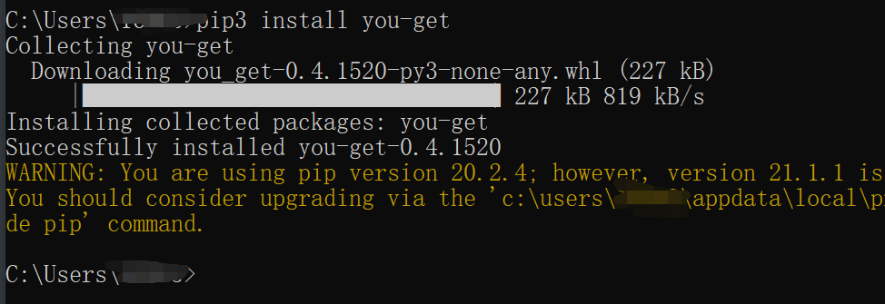
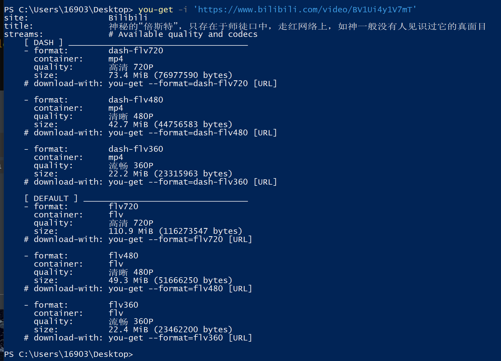
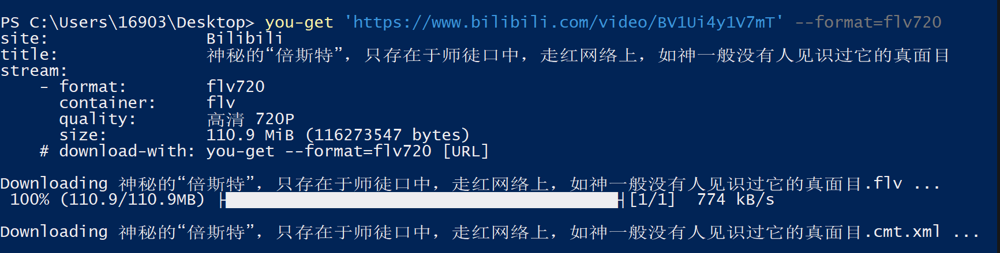

# you-get 一款开源的网页视频下载软件

> 可用于下载 Youtube、bilibili 等热门网站的视频

# 安装

### 安装 Python

略

### 安装 you-get

安装好 Python 后，打开 cmd，输入命令安装you-get，如果提示 pip3 命令不存在，改为 pip 如下图即可

```shell
pip3 install you-get
```



## 使用

### 查看可供下载的画质

使用 `-i` 参数查看可以下载的画质

```shell
you-get -i 'https://www.bilibili.com/video/BV1Ui4y1V7mT'
```

单引号里自行替换为视频地址，接着会显示有哪些画质可供下载，接着下载视频



下载视频命令

```shell
you-get 'https://www.bilibili.com/video/BV1Ui4y1V7mT' --format=flv720
```



它还顺便下载了弹幕

### 使用代理

### 使用FFmpeg合成视频

```
youtube-dl -i PLRMOX8QaZK8zZ1uKjEkXnMtXJUA6Mo9xh --proxy 127.0.0.1:1080
```


## 参考

[you-get](https://github.com/soimort/you-get)

[中文使用说明](https://github.com/soimort/you-get/wiki/%E4%B8%AD%E6%96%87%E8%AF%B4%E6%98%8E#supported-sites)

[一行代码下载网站视频，python库you-get](https://www.bilibili.com/read/cv6004816/)

[FFmpeg将视频和音频合并](https://jingyan.baidu.com/article/c74d6000d922f30f6b595d5f.html)

