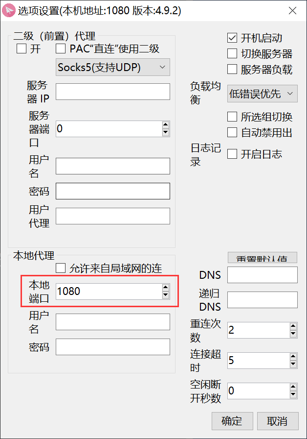
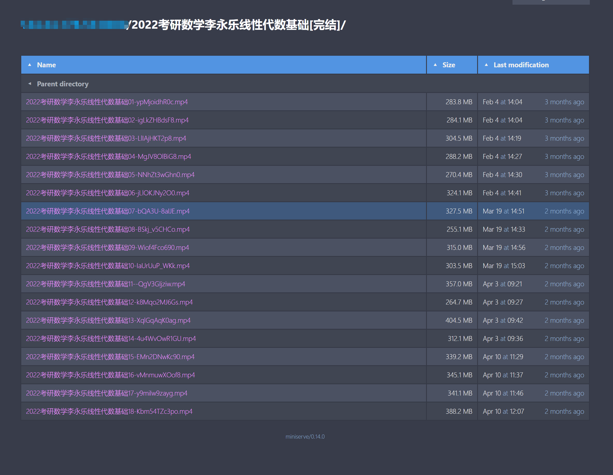
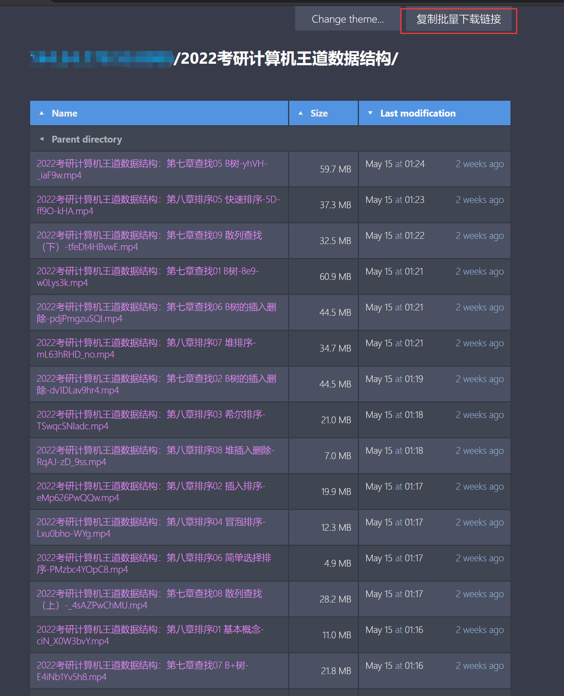
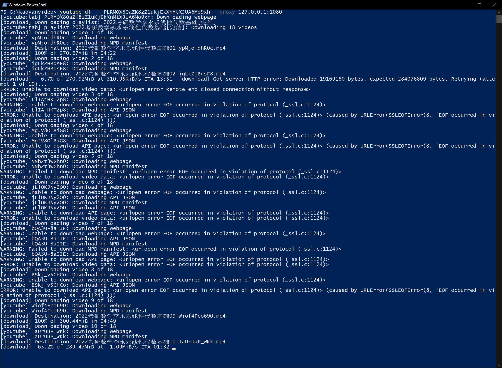
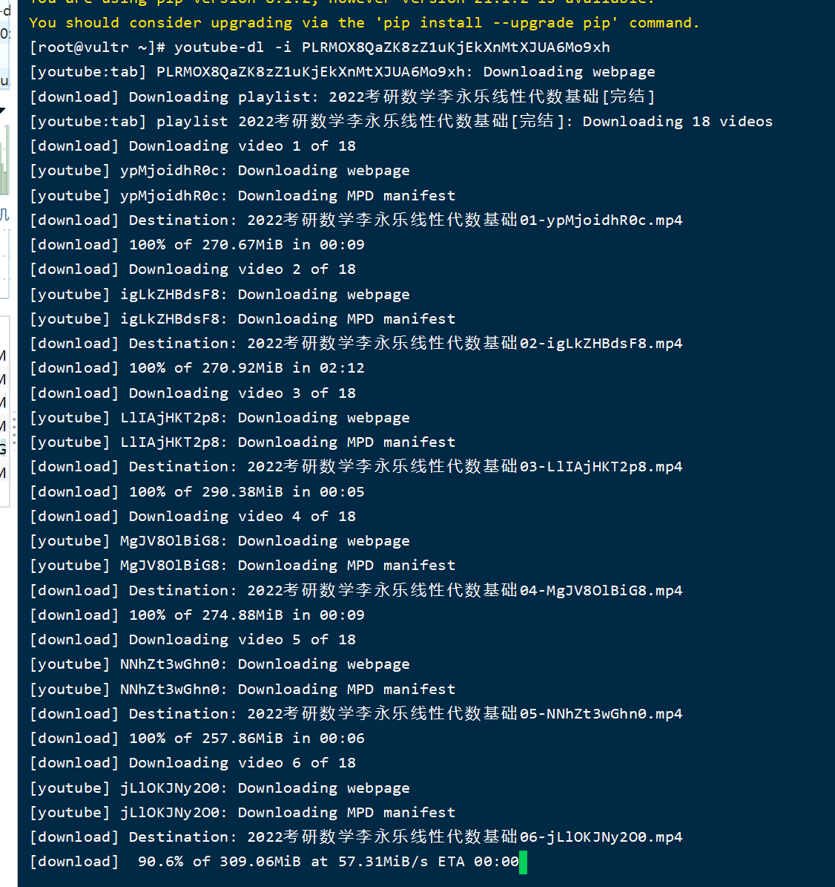
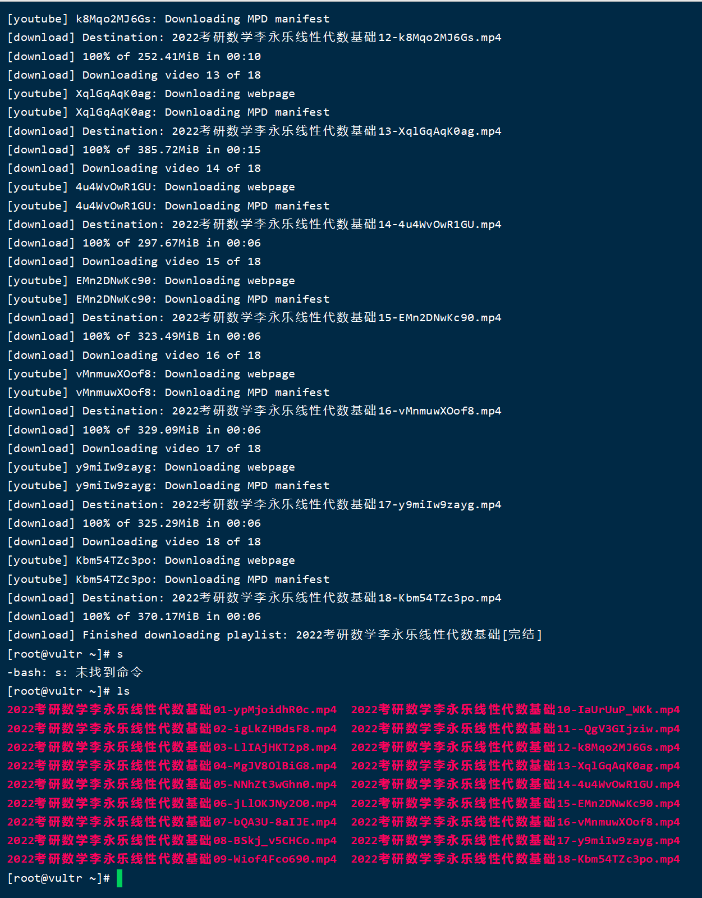

# youtube-dl 下载 Youtube 视频

## 安装

### 安装Python

#### windows

略

#### CentOS

系统自带Python2，不需要再安装Python

需要安装pip

```shell
# CentOS yum源 中默认没有 pip，需要安装 扩展源EPEL
sudo yum -y install epel-release
sudo yum -y install python-pip
pip  -V
```

### 安装 youtube-dl

```shell
pip install --upgrade youtube-dl
```

## 使用

使用代理下载播放列表，以 `https://www.youtube.com/watch?v=ypMjoidhR0c&list=PLRMOX8QaZK8zZ1uKjEkXnMtXJUA6Mo9xh`为例。

找到 `list=`后面的一串字符，此处为`PLRMOX8QaZK8zZ1uKjEkXnMtXJUA6Mo9xh` 这是该播放列表的id，替换下面命令中的字符串，后面的 `127.0.0.1:1080` 为本地代理的ip和端口号。可在proxy软件中查看

更多的命令行参数自行查看官方文档。

#### 使用代理（Windows本机下载）

```shell
youtube-dl -i --proxy 127.0.0.1:1080 播放列表id 
```



#### 不使用代理（CentOS 服务器下载）

```shell
youtube-dl -i 播放列表id
```

### 从vps中下载到本地（Windows本地下载不需要这一步）

#### 前言

为什么要用日本的服务器下载到服务器上，然后再下载到本地？

因为在使用过程中，用本地网络直接下载经常出现网络问题，搞人心态。

用日本服务器下载比较放心。

之后使用 `miniserve`给文件夹提供 `web` 服务，方便我们直接使用浏览器下载文件。也可以用 `nginx`，不过配置麻烦些

#### 安装 miniserve

```shell
sudo curl -L https://github.com/svenstaro/miniserve/releases/download/v0.14.0/miniserve-v0.14.0-x86_64-unknown-linux-musl -o /usr/local/bin/miniserve && sudo chmod +x /usr/local/bin/miniserve
```

#### 为当前目录提供web服务

前台运行

```shell
miniserve `pwd`
```

后台运行，推荐使用

```shell
nohup miniserve `pwd` &
```

#### 开放端口

开放8080端口并重启防火墙

```shell
firewall-cmd --add-port=8080/tcp --permanent && firewall-cmd --reload
```

#### 浏览器访问服务器

访问服务器的 `ip:8080`

效果如下图



#### 批量下载文件

```javascript
document.getElementsByClassName('file')
```

- https://motrix.app/

  批量下载器，得到下载网站后，粘贴到这个软件中，进行批量下载

- 获取批量下载地址的油猴脚本

    ```javascript
    // ==UserScript==
    // @name         复制miniserve批量下载地址
    // @namespace    http://tampermonkey.net/
    // @version      0.1
    // @description  try to take over the world!
    // @author       You
    // @match        此处替换成自己的服务器网址
    // @icon         https://www.google.com/s2/favicons?domain=178.53
    // @require      https://cdn.jsdelivr.net/npm/clipboard@2.0.8/dist/clipboard.min.js
    // @grant        none
    // ==/UserScript==

    (function() {
        'use strict';

        let files = document.getElementsByClassName('file')
        let text = ''
        for(let f of files){
            text = text + f.href + '\n'
        }
        console.log(text)
        let navEl = document.getElementsByTagName('nav')[0]
        var str = '<div><p id="copyDiv" data-clipboard-text="'+ text + '">复制批量下载链接</p></div>';
        var child = document.createElement('div');
        child.innerHTML = str;
        child = child.firstChild;
        navEl.appendChild(child);
        var clipboard  = new ClipboardJS('#copyDiv');
        clipboard.on('success', function(e) {
        console.info("复制成功");
            e.clearSelection();
        });
        clipboard.on('error', function(e) {
            console.info("复制失败");
        });
    })();
    ```



## 问题 

vultr的服务器，运行serve命令后，访问 ip:8080，无法响应，但是另一家的vps用同样的方法(后来发现，这个vps防火墙之前被我关闭了的)，访问成功，且可以正常下载

vultr 8080端口关闭，排查后发现防火墙问题，需要开发对应端口，已解决

- 以下为Windows下直接下载截图，可以看到下载部分视频时网络出现了问题，可以之后需要输入命令下载一次，支持断点续传以及检测视频是否已经曾经下载完毕。



- 默认下载的 720p 视频。1080p以及以上的视频需要将音频与视频合成

## 效果

### CentOS下

用的vultr日本服务器中转





## 参考

https://stackoverflow.com/questions/48422377/youtube-downloading-a-playlist-youtube-dl

https://github.com/ytdl-org/youtube-dl

[CentOS 安装pip](https://www.jianshu.com/p/df3bb8e2b1c3)

[miniserve](https://github.com/svenstaro/miniserve)

https://privaterookie.github.io/2019-05-01-miniserve-miniserve-%E7%AE%80%E5%8D%95%E7%BE%8E%E8%A7%82%E7%9A%84%E6%96%87%E4%BB%B6%E6%9C%8D%E5%8A%A1%E5%99%A8/

[nohup命令](https://www.cnblogs.com/baby123/p/6477429.html)

[centos 7.3 开放端口并对外开放](https://blog.csdn.net/qq_24232123/article/details/79781527)
